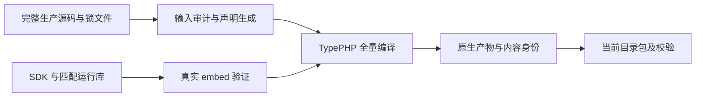

# type-build

TypeApp 的开发与构建组件：生成配置、路由和模型，审计完整生产源码，调用 TypePHP 全量编译，并收集原生依赖形成可校验的运行包。构建工具留在开发环境，部署端无需 Composer、TypePHP 或编译 SDK。

**已内置四平台 Swoole 模块。** 安装包含 `resources/swoole/` 的组件版本后，匹配构建默认校验并复用，无需另行下载、编译 Swoole。应用无需声明整目录资源，只收集当前平台选中的模块与实际依赖；ABI、许可证及覆盖方式见[资源说明](resources/swoole/README.md)。

最终交付目标为一个主程序文件加外置配置，非系统原生库完整静态链接、启动不释放运行库。当前 `package` 仍生成目录包，`archive` 生成归档，部署须保留完整包。使用入口见[构建指南](https://iots.top/#/guide/plugins/type-build)，开发、构建和部署的分工见[环境与依赖](https://iots.top/#/guide/environment)。

## 阅读与操作路径

首次使用先准备应用声明和匹配 SDK，再依次运行 `doctor`、`prepare`、原生构建与 `--inspect`。下面的[最小构建入口](#最小构建入口)给出完整源码与配置；[构建教程](https://iots.top/#/guide/plugins/type-build)补充各步骤的预期结果、内置模块选择、目录打包与校验命令。



开发生成成功、原生编译成功、无源码运行通过是不同结果。构建失败时保留本次诊断，不能用仍存在的旧产物代替本次验收；生成目录可以重建，应用锁文件、源码和真实验收身份需要保留。

## 实现与验收范围

Linux x64 / ARM64、macOS ARM64、Windows x64 已在同一源码基线上通过默认原生 CI，覆盖完整应用 AOT、三库场景、组件与模板消费。目录包已通过实际部署用例，各平台的主应用、模板及隔离范围分别记录；完整静态单程序仍未完成，见[平台与验收](https://iots.top/#/guide/platforms)。

构建声明可通过 `threads` 登记已编译业务入口。构建器核对受控 Swoole/PHPX ABI 2、源码摘要与 fiber 通知配置，并在正常模块启动阶段发布应用符号；线程内协程作用域、初始化失败和清理边界见[已编译业务线程](https://github.com/zoujingli/typeapp/blob/main/docs/development/compiled-business-threads.md)，实际平台结果按该页记录。

线程适配另提供 TypeApp 私有 `Thread::TYPEAPP_JOIN_ABI=1` 与 `joinWithin(int $milliseconds)` 候选，只适用于编译线程；等待完整 C++ 线程局部清理通知后仍由 Swoole join。超时保留所有权，不取消或 detach；非零等待会阻塞调用方线程，只供独立主控使用。它不等于完整停止监督或硬实时截止，固定缺口、验收及撤除条件见同页的“有截止的完成等待候选”。

`SwooleThreadSource` 还提供私有 `TYPEAPP_CONTROL_ARGUMENT_ABI=1`，允许 `startNative()` 的第四参数传递原生 `Thread\Map`；仅扩大编译入口的参数接缝，数据共享与引用回收继续使用上游 ZendArray/ThreadResource。当前调用者是 `type-runtime` 的有限线程监督及 `type-core` 的 HTTP 线程入口。原两/三参数形状保持不变；上游编译入口可等价传入受控 Map 后撤除此私有接缝，不能用脚本线程代替无源码入口。

`SwooleIoSource` 仍是显式文件候选，独立核验原文再组合线程适配。当前私有 `SWOOLE_FILE_IO_ABI=2` 将原生提交硬截止交给 `type-runtime` 的独立主控，不再创建额外监督线程；Swoole 原工作池、空闲回收通知与 `release_callback` 继续负责调度和 join。主控持有默认完成接收者，防止业务线程退役后通知指向已关闭的描述符；诊断、候选配置和撤除条件见[文件 I/O 记录](https://github.com/zoujingli/typeapp/blob/main/docs/development/swoole-file-io.md)。它不进入默认线程构建，普通 metadata 旁路、上传故障及平台汇合继续验证。

显式 HTTP 线程候选通过 `SwooleHttpSource::apply($directory)` 为固定上游增加已绑定 Socket 的协程 HTTP 接入，继续使用原生 accept、解析器、响应与 shutdown；与 `SwooleThreadSource` 的原生 Socket 参数配合。显式 `typeapp_max_connections` 复用原生连接表、Channel 和 FD 延迟关闭实现连接准入，属于 TypeApp 私有配置，不是经典 `max_connection`。此适配独立于默认线程与 FILE 适配，私有 ABI、失败复现、所有权及撤除条件见[HTTP 线程接入](https://github.com/zoujingli/typeapp/blob/main/docs/development/http-native-threads.md)，不能将候选入口当作官方 API 或完整平台支持。

同一候选的 `typeapp_http1_input=true` 在原生解析回调覆盖前拒绝重复 Host、Authorization、Content-Type，其余多值头复用上游数组机制；仅接受 HTTP/1.0 和 HTTP/1.1。它是 TypeApp 私有布尔选项，配合原生 `http_parse_cookie=false` 供既有 PSR 处理链执行输入策略；默认原生行为、经典入口及 HTTP/2 不因此获得相同验收结论。

构建环境使用的 Composer 库，提供 `type <应用构建配置.json>` 入口。它读取应用生产依赖，要求各生产包显式声明可编译源码，再调用固定版本的 TypePHP。

开发入口统一为create、doctor、prepare、dev、watch、test、build；watch复用type-runtime的信号所有权，type-runtime也是构建工具的明确依赖。模式、生命周期与实际验收边界见[开发命令说明](https://github.com/zoujingli/typeapp/blob/main/docs/development/developer-cli.md)。安装本包时，Composer 从 Packagist 自动解析 type-runtime 及编译工具依赖。

prepare按完整源码、声明、生成器及锁文件内容身份复用不可变代次，逐次校验清单和生成文件；缺少代次才持锁生成。并发准备不重复串行解析同一输入，损坏或准备期间变化明确拒绝；运行环境和dotenv不参与代次身份，不能以可变current指针跳过验证。

模型使用直接继承 `Type\Orm\Model` 的 PHP 类型属性及 `Table/Column` Attribute，从生产源码静态转换为同名业务类。开发入口先加载本代模型，AOT 编译同一属性钩子、水合工厂和业务方法；原源码与转换结果均进入审计。`ModelCompiler::compile($sources)` 返回 `code/originals/models`，不加载业务类。模型 JSON 与 `models` 配置已移除，旧配置明确报迁移错误。声明、限制和迁移步骤见[模型说明](https://github.com/zoujingli/typeapp/blob/main/docs/guide/plugins/type-orm.md#models-relations-output)。

路由由生产源码上的 `#[Route]`/`#[Group]`/`#[Resource]` 或 `config/route.php` 声明。构建 JSON 只指向该 PHP 文件，不再读取 JSON 路由表；旧 `.json` 路径明确报迁移错误。`RouteCompiler::declarations()` 静态解析 `declare(strict_types=1)` 与一次 return 常量数组，不 include、不读取环境。完整契约见[HTTP 与路由](https://github.com/zoujingli/typeapp/blob/main/docs/guide/routing.md)。

同一入口还提供 `type package <产物> <新发布目录> [.env.example]` 和 `type verify-package <目录> <受信清单SHA256>`；运行目录不包含本构建工具或 Composer。平台布局、资源、启动校验与实际限制见[原生发布目录说明](https://github.com/zoujingli/typeapp/blob/main/docs/development/native-packages.md)。发布包验收以具体源码、平台和隔离报告为准，不能仅凭接口存在宣布完整交付。

`type service <发布目录> <服务声明.json> <新服务目录> <受信清单SHA256>` 复用发布校验，生成launchd/systemd/WinSW配置与摘要记录。目标发布、数据和服务配置分离；生成器不读取.env、不安装/启用服务、不修改账号权限。Unix显式使用非root账号，Windows需提供外部受信WinSW包装器且使用LocalService。声明、运行依赖与实际验证范围见[原生服务管理](https://github.com/zoujingli/typeapp/blob/main/docs/development/native-services.md)。

## 安装与版本

本组件通过 Packagist 提供 Composer 安装，源码在对应 GitHub 子仓维护。Composer 自动解析传递依赖，消费应用无需逐一登记 VCS 仓库。

```sh
composer config minimum-stability dev
composer config prefer-stable true
composer require --dev zoujingli/type-build:dev-main
```

`dev-main` 的分支别名为 `1.0.x-dev`；本仓组件间使用 `~1.0.0@dev` 约束。开发分支不等于已发布稳定 1.0 版本。提交应用的 `composer.lock` 固定实际分发提交；构建工具只放 `require-dev`。详细依赖与公开分发规则见[组件组织与安装](https://github.com/zoujingli/typeapp/blob/main/docs/development/component-structure.md)。

支持协议 1 的 `extra.type.sources`，没有协议的第三方包可通过应用 imports 提供精确版本的适配。构建器检查自动加载入口、源码、排除原因与资源；不支持的生产包会明确失败。根应用的PSR-4、PSR-0、classmap和files生产入口同样与最终编译清单交叉核对，遗漏时在编译前明确拒绝并保护旧产物；测试消费者须声明自己的应用输入，不能借用主仓Composer映射却漏掉主仓业务。应用入口必须是TypePHP支持的声明式源码，产物只能写入应用自己的build目录。编译失败不会用旧二进制冒充本次成功结果。

第三方源码中需要调整的已知 TypePHP 语义可通过 `rewrites` 声明准确文件、SHA-256、中文原因和有限替换。构建器先审计完整生产源码，再生成保持行号的完整适配副本，原 Composer 文件保持不变；原文、适配结果与映射均参与构建身份。版本、摘要或匹配次数变化即拒绝使用旧适配，具体约束见[第三方适配说明](https://github.com/zoujingli/typeapp/blob/main/docs/development/source-imports.md#版本限定的源码适配)。

本组件在 [resources/swoole](resources/swoole/README.md) 携带四个平台的 Swoole 6.2.1 共享模块、固定清单及原始许可证。匹配 PHP 8.5.10 ZTS 的构建默认按组件安装位置校验并复用，不另行下载 Swoole；独立应用无需复制主仓目录。真实 embed 已内置、显式 `runtime.modules` 和有效 `TYPE_SWOOLE_MODULE` 优先；默认内置清单缺失、ABI 不匹配或内容校验失败时明确拒绝。PHP SDK、PHPX 和其他原生依赖仍需准备，此能力不等于完整静态单程序交付。

构建会初始化真正的embed探针，区分CLI和embed的内置扩展；运行声明按Linux/Darwin/Windows分开。其他缺失扩展可由SDK标准目录或显式文件/SHA256候选提供，Swoole遵守上述选择顺序；加载警告、ABI不符或缺少函数在编译前拒绝。选中的共享扩展、依赖及运行配置进入构建身份和发布清单，不在部署后手工补库。当前 INI 默认 `swoole.enable_library=On`，仅允许固定 Swoole 官方内置 PHP 库沿用官方加载；库内容由承载扩展字节摘要约束，源码版本与构建开关随产物证据核对，其余生产 PHP 仍全量 AOT。参见[真实embed运行依赖](https://github.com/zoujingli/typeapp/blob/main/docs/development/runtime-profiles.md)。

支持手写入口与声明式命令装配两种模式。装配模式读取生产源码 AST，验证显式依赖、接口与生命周期关系，生成直接工厂和命令入口；环境配置在应用启动时取得。禁用模块不注册命令，但其生产源码仍接受编译检查。

生成代码保留固定回调协议：路由控制器与中间件工厂为零参数；动作接收一个 `ServerRequestInterface`；队列工厂接收一个 `JobContext`；模型水合工厂接收一个数据库行数组。应用提供的工厂必须完整声明这些参数，TypePHP 不隐式接受多余实参。构建期 `BuildLock` 操作为零参数，`ArtifactCache` 编译器接收候选产物路径，输入复核回调为零参数。

构建器与 TypePHP 桥接使用受限的 Composer 类加载，不执行应用的 autoload.files 初始化。编译子进程不继承任意业务环境或 PHP 自动注入配置；本工具以 PHP 运行，不进入应用生产执行链。

操作文档通过构建期PHPDoc语法树保留原类型语境：use别名、同命名空间类型、类常量和闭包类型在组合类中使用准确名称，说明文字、数组键和字面量不改写；模板/类型别名保持自己的作用域。phpstan/phpdoc-parser仅是构建工具依赖，不进入应用生产包，不解释PHPDoc注解为运行时操作。语法树与保留格式输出接口见[解析器说明](https://github.com/phpstan/phpdoc-parser/tree/2.3.5)。

构建身份覆盖源码、锁定依赖、生成协议、实际工具链/ABI、参数与资源，使用内容寻址的完整本机原生产物缓存。产物附带可独立读取的身份清单，并生成 `Type\Generated\BuildIdentity` 供应用查询。支持 `--inspect`、`--verify`、`--install-lock` 与 `--stage` 入口；缓存信任边界、隔离容器要求及分层验收证据见[构建身份说明](https://github.com/zoujingli/typeapp/blob/main/docs/development/build-identity.md)。

## 最小构建入口

`type package`还会将组件内的完整操作手册复制为`OPERATIONS.md`，按同一发布清单校验并进入归档。手册覆盖首次部署、维护窗口、三库备份/恢复与不可自动回滚情况；应用运行端不需要Composer或编译工具。来源见[操作手册](docs/operations.md)。

发布根的 `LICENSE`、`NOTICE` 取自当前应用在构建时记录的原文，实际存在才复制；组件与第三方材料分别保留在依赖资源索引中，不用构建组件的许可替代应用许可。材料缺失继续由 `notices.require-complete` 和构建报告的覆盖状态处理，不强制外部应用采用 Apache-2.0 或提供 NOTICE。身份生成协议 4 支持这一行为；协议 3 的旧产物若同时含两份应用材料仍可打包，否则需要重新构建。

在独立应用中准备 `app/main.php`（全局只声明入口）：

```php
<?php

declare(strict_types=1);

/** 声明式业务入口，编译后不需要源码加载器。 */
function main(): void
{
    echo "Type 应用已启动。\n";
}
```

应用自己的根 `type-app.json` 可以保留如下布局：

```json
{
  "name": "type-example",
  "version": "1.0.0-dev",
  "entry": "app/main.php",
  "sources": ["app"],
  "output": "build/type-example",
  "build-directory": "build/compiler"
}
```

```sh
vendor/bin/type type-app.json
vendor/bin/type --inspect build/type-example
```

以上工具在构建环境执行，不作为生产 PHP 入口。开发主仓自己的对应配置已集中至 `docs/build-config/`；不要把独立消费者仍有效的根配置路径机械替换成主仓路径。

## 接口与源码组织

`NativeBuilder/SourceSet/SourceRewriter` 处理全量输入审计与适配；`CommandAssembly/ModelCompiler/RouteCompiler/JobCompiler/ConfigCompiler/OperationCompiler` 分别持有各声明的生成逻辑；`BuildIdentity/ArtifactManifest/ArtifactCache/BuildCapabilities` 管理身份、缓存与兼容；`BuildLock/BuildWorkspace/BuildEnvironment` 管理隔离目录、并发和子进程环境。`TypephpCompatibility` 仅承接锁定工具链的已记录兼容修正。

`project-root` 相对配置文件所在目录，其他声明相对选定的项目根；不填写时保持既有独立消费者语义。开发主仓统一将专项构建配置放在 `docs/build-config/`，独立应用仍可使用自己的根 `type-app.json`。`ConfigCompiler::generate($root, ['class' => ..., 'files' => [...]])` 返回 `class/files/code`，`configuration.files` 里的 PHP 只解析为声明，不在构建期读取秘密；`config/route.php` 不在该列表中。 `RouteCompiler::declarations($root, $routing)` 读取相对 PHP 文件，`generate($root, $configuration, $sources)` 返回 `class/routes/code`。`OperationCompiler::generate($root, ['classes' => [生成类 => 业务类]], $sources)` 返回 `code/operations`，生成组合对象而非运行时 AOP；调用者必须明确使用生成对象。事务参数、缓存键、TTL、返回和受限方法类型均在构建期检查。

## AOT 与运行要求

本包应放在 `require-dev`，其 PHP-Parser、Composer 与 TypePHP 编译器在构建阶段运行；不是生产服务的一部分。当前锁定 TypePHP 0.9.3、PHPX 2.9.2 和 PHP 8.5.10 ZTS；构建须提供匹配目标平台的完整 SDK。Windows x64 已完成 SDK 准备、三库独立 ORM、完整应用 PHP/AOT、模板及搬迁包回归；各平台的隔离强度与未完成项统一见[平台与验收](https://iots.top/#/guide/platforms)。生产运行库由实际产物清单确定，不把编译 SDK、源码或构建秘密复制进运行镜像。

语言与整体编译约定见[TypePHP 0.9 基线](https://github.com/zoujingli/typeapp/blob/main/docs/standards/typephp.md)。标量存储、引用及std编译期接口按新版规则实现，带上下文的闭包必须完整声明参数；PHP开发对照只使用具有真实等价行为的能力。

## 主仓验证入口

以下命令在安装完整开发依赖的 [TypeApp 开发主仓](https://github.com/zoujingli/typeapp/blob/main/composer.json)根执行，不是分发子仓默认自带的脚本。需要真实数据库、Redis、Linux SDK 或容器的用例应按其文档准备专属测试环境；先构建相应产物，再运行 native 验收。

```sh
composer test:build-errors
composer test:build-source-collection
composer test:build-cache
composer test:build-install
composer test:imports
composer test:source-rewrites
composer test:isolated-build
composer test:native-packaging
php tests/configuration.php
php tests/operations.php
```

- [配置生成](https://github.com/zoujingli/typeapp/blob/main/docs/development/configuration.md)
- [事务与缓存调用生成](https://github.com/zoujingli/typeapp/blob/main/docs/development/operations.md)
- [隔离构建](https://github.com/zoujingli/typeapp/blob/main/docs/development/isolated-build.md)
- [干净运行镜像](https://github.com/zoujingli/typeapp/blob/main/docs/development/clean-runtime.md)
