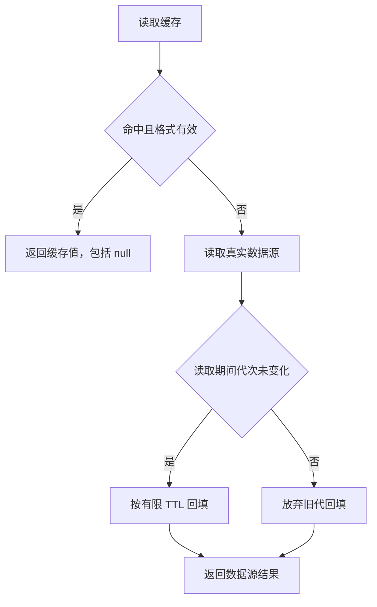

# type-cache

复用 type-redis 的 script 用途连接，提供显式 codec、有限 TTL、缺失值语义与命名空间回收。

## 安装与版本

本组件通过 Packagist 提供 Composer 安装，源码在对应 GitHub 子仓维护。Composer 自动解析传递依赖，消费应用无需逐一登记 VCS 仓库。

```sh
composer config minimum-stability dev
composer config prefer-stable true
composer require zoujingli/type-cache:dev-main
```

`dev-main` 的分支别名为 `1.0.x-dev`；本仓组件间使用 `~1.0.0@dev` 约束。开发分支不等于已发布稳定 1.0 版本。提交应用的 `composer.lock` 固定实际分发提交；构建工具只放 `require-dev`。详细依赖与公开分发规则见[组件组织与安装](https://github.com/zoujingli/typeapp/blob/main/docs/development/component-structure.md)。

```php
<?php

declare(strict_types=1);

use Type\Cache\JsonCodec;
use Type\Cache\NamespaceStore;
use Type\Cache\TypedCache;
use Type\Redis\Purpose;
use Type\Redis\RedisConfiguration;
use Type\Redis\RedisManager;
use Type\Runtime\ExecutionScope;

/**
 * 缓存有限 TTL 的公开示例数据，资源不得跨本次执行作用域使用。
 */
function main(): void
{
    $host = getenv('REDIS_HOST');
    $port = filter_var(getenv('REDIS_PORT') === false ? '6379' : getenv('REDIS_PORT'), FILTER_VALIDATE_INT,
        ['options' => ['min_range' => 1, 'max_range' => 65535]]);
    if (!is_int($port)) {
        throw new InvalidArgumentException('REDIS_PORT 必须为有效整数端口');
    }
    $manager = new RedisManager(['default' => new RedisConfiguration($host === false ? '127.0.0.1' : $host, $port)]);
    $scope = new ExecutionScope();
    try {
        $redis = $manager->connection($scope, 'default', Purpose::SCRIPT);
        $store = new NamespaceStore($redis, 'readme-example', 'local', 'profile-v1');
        $cache = new TypedCache($store, JsonCodec::data('profile-v1'), 60000);
        $profile = $cache->remember('user:7', static fn (): array => ['id' => 7, 'name' => '示例']);
        echo json_encode($profile, JSON_THROW_ON_ERROR | JSON_UNESCAPED_UNICODE) . "\n";
    } finally {
        try {
            $scope->close();
        } finally {
            $manager->close();
        }
    }
}
```

`Codec` 声明格式身份和读写转换；`JsonCodec::data()` 支持 null、标量和数组，不冒充支持任意 PHP 对象。DTO 使用显式的 JsonCodec 工厂转换，载荷不携带可动态加载的类名。格式不符或解码失败返回未命中，写入类型错误明确抛出。

`CacheItem` 区分未命中与命中的 null。`put/get/delete` 及批量入口对应同一模型，批量按位置返回结果，避免 PHP 字符串键转整数影响映射。类型化入口默认 60 秒，TTL 必须有限且不超过配置上限；零或负 TTL 删除。单个载荷和批次字节数均有限制。

`remember()` 命中时返回缓存；未命中调用一次回源函数，回源异常不缓存。可显式 bypass 回源，依赖错误默认向调用者传播；没有暗中吞掉故障或承诺并发回源只执行一次。语义为最终一致，强一致读取由应用绕过缓存并选择相应数据库连接。

`remember()` 的 loader 为零参数 `Closure(): mixed`；`CacheReader::read()` 的 source 为 `Closure(bool): mixed`，始终接收强一致标志。`JsonCodec` 的 encode、decode 均为单参数 `Closure(mixed): mixed`，分别接收业务值和解析后的 JSON 数据。TypePHP 严格检查实参数量，按各入口签名声明闭包，依赖通过显式捕获传入。

命名空间区分应用、环境和格式。`clear()` 原子切换随机新代次，旧写入只能写它观察到的代次；回源期间发生 clear 时不回填新代次。并发 clear 不复用代次，不使用 FLUSHDB/FLUSHALL。

每代有显式键索引，有限 TTL 同时约束索引的存活时间；`collect($limit)` 每次最多处理指定数量的旧键和代标记。应用需周期调用回收，永久 TTL 的 adapter 更须保留索引并使用 noeviction 等不会丢弃回收元数据的缓存实例；有限 TTL 数据即使索引丢失仍会自行到期。旧代回收只使用当前命名空间，不扫描其他应用数据。

Redis 脚本具有原子执行顺序但不具备错误回滚，OOM 等写入故障沿用底层可能已生效的错误语义。缓存与可靠任务存储应使用独立故障域。

DTO、类型、TTL、代次竞争、旧写入拒绝、回源与回收均有真实 Redis 验收入口；历史 PHP/原生与独立消费证据见下方交付索引。

## PSR-16 adapter

`SimpleCache` 实现 PSR-16 3.0，使用独立 `SignedSerializer` 完成 PHP 值往返。TTL 单位为秒，支持 DateInterval；null 使用配置默认，默认 null 表示永久，非正数删除。非法键使用 PSR InvalidArgumentException；get/getMultiple 保留默认值和实际 null 的区别。

序列化保存整数、字符串、布尔、浮点、数组和显式登记的可序列化对象，保留循环引用、NAN/INF 及内部 DateTime 状态。资源明确拒绝；对象类必须由应用在构造 serializer 时登记并加载，允许的类型变化也改变载荷策略身份。该要求是对象缓存的信任配置，不能用受限 JSON codec 代替完整 PHP 类型 adapter。

密钥至少 32 字节，HMAC 绑定命名空间、代次、逻辑键、对象类型策略和完整二进制内容。长度、格式和签名通过之后，先不执行对象代码地检查序列化类身份，再调用只允许已登记类的 unserialize。未知类型、错误密钥、篡改、跨键或跨代重放均为未命中。应用必须信任登记类的序列化钩子，不将密钥放入构建配置或公开文档。

永久 TTL 使用同一代次索引回收：clear 立即使旧代不可见，collect 分批删除旧数据，索引不能被驱逐或手工删除。生产应使用不驱逐元数据的缓存实例并调度 collect，缓存数据不提供可靠消息存储保证。

PSR 真实 Redis 测试包含精确类型、对象钩子、循环引用、TTL、非法键、篡改不执行对象代码和永久旧数据回收；独立 Composer 消费入口为 `tests/cache-consumer.php`，原生模式加 `--native`。

## 验证命中与失效

在最小示例中创建 `$cache` 后，加入以下片段，观察命中的 null 与未命中的区别：

```php
$cache->put('nullable', null);
$before = $cache->get('nullable');
$cache->clear();
$after = $cache->get('nullable');
echo json_encode(['before_hit' => $before->hit(), 'before_value' => $before->value(),
    'after_hit' => $after->hit()], JSON_THROW_ON_ERROR) . "\n";
$cache->collect(100);
```

结果应为 `{"before_hit":true,"before_value":null,"after_hit":false}`。`clear()` 只切换本示例命名空间的代次；`collect(100)` 有界回收旧键，不能替代持续的回收调度。



强一致读取、回源失败及清理教程见[缓存组件指南](https://iots.top/#/guide/plugins/type-cache)。数据库提交和 Redis 失效是两个步骤，需要可恢复失效时应记录持久意图；缓存代次不构成跨系统事务。

## 接口与源码组织

`TypedCache/CacheItem/CacheReader/Codec/JsonCodec` 负责类型化接口与回源策略；`NamespaceStore` 负责 Redis 代次和索引；`SimpleCache/SignedSerializer/SerializedPayload` 负责 PSR-16 类型往返与可信载荷；`Attribute/Cacheable/CacheEvict` 只表达构建期调用策略，不持有运行时缓存。

示例在独立 `readme-example/local/profile-v1` 命名空间写入有限 TTL 数据。`Cacheable` 的 cache 必须指向 `TypedCache` 参数，业务标量参数全部进入 key 模板；只有通过 `OperationCompiler` 生成的包装才生效。`#[CacheEvict(cache: 'cache', all: true)]` 仅切换该缓存命名空间；与事务组合在最外层提交确认后失效，失败沿用 `AfterCommitException`，不重跑已提交业务。`Cacheable` 不与事务或同方法 CacheEvict 混用；具体限制见操作生成说明。

## AOT 与运行要求

依赖 `type-redis`、`type-runtime` 与 PSR-16，不要求 ORM 或 core；声明事务组合时应用另装 ORM/build。PSR 接口与已登记对象实现一起 AOT，运行包含 phpredis、PHPX/libphp 和实际原生库。`unserialize` 仅能调用已编译且明确允许的类，不允许缓存载荷驱动 PHP 源码加载。

语言与整体编译约定见[TypePHP 0.9 基线](https://github.com/zoujingli/typeapp/blob/main/docs/standards/typephp.md)。文中的声明式示例不使用省略实参的回调兼容层；带上下文的闭包必须完整声明参数。

## 主仓验证入口

以下命令在安装完整开发依赖的 [TypeApp 开发主仓](https://github.com/zoujingli/typeapp/blob/main/composer.json)根执行，不是分发子仓默认自带的脚本。需要真实数据库、Redis、Linux SDK 或容器的用例应按其文档准备专属测试环境；先构建相应产物，再运行 native 验收。

```sh
composer test:cache
composer build:cache
composer test:cache-native
composer test:psr-cache
composer build:psr-cache
composer test:psr-cache-native
composer build:cache-consistency
composer test:cache-consistency-native
```

- [缓存一致性](https://github.com/zoujingli/typeapp/blob/main/docs/development/cache-consistency.md)
- [编译期缓存声明](https://github.com/zoujingli/typeapp/blob/main/docs/development/operations.md)
- [TypeApp 标准项目缓存说明](https://github.com/zoujingli/typeapp/blob/main/docs/development/typeapp.md)
