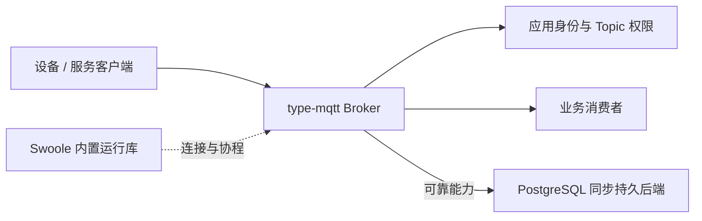

# type-mqtt

可独立安装和独立进程运行的 TypeApp MQTT 服务端组件。提供 MQTT 3.1.1/5.0 的 TCP/TLS 连接、认证、CONNECT/CONNACK、PING、DISCONNECT、客户端标识接管、精确及通配订阅/取消、MQTT 5 订阅选项与标识、二进制 QoS 0 路由，以及明确配置 PostgreSQL 同步持久存储后的 QoS 1/2 双向交付、保留消息、持久会话、遗嘱与延迟遗嘱、MQTT 5 共享订阅、重启恢复及跨节点接管与路由。

通信与基础并发统一使用 Swoole 官方能力；服务端监听由 Swoole Server 管理，客户端统一使用 Swoole Coroutine Socket，非协程调用由现有 CoroutineRuntime 使用官方 Scheduler 执行，持久 worker 使用 Swoole PROC hook 管理的进程管道。当前 Broker 使用经典 Swoole Server，持久 worker 使用受控命令进程；进程能力不可用时所需的角色适配与隔离、停止验收尚不能由接口存在推定完成。

## 安装与版本

通过 Packagist 在应用根安装开发分支，Composer 自动解析传递依赖，无需额外登记 VCS 仓库：

```sh
composer config minimum-stability dev
composer config prefer-stable true
composer require zoujingli/type-mqtt:dev-main
```

本组件使用 Apache-2.0，完整材料见 LICENSE 与 NOTICE。开发分支不代表稳定版本或全部协议符合性验收已通过；提交应用的 composer.lock 固定实际源码版本。

## 最小离线示例：连接字段与消息编码

先确认安装后的公开类型能够在应用中使用。将以下代码保存为声明式 `app/main.php`，由开发启动器调用 `main()`；它解析一个完整 CONNECT 正文、编码 QoS 0 PUBLISH，并观察非法 Topic 的拒绝，不打开网络或数据库。

```php
<?php

declare(strict_types=1);

use Type\Mqtt\ConnectPacket;
use Type\Mqtt\Message;
use Type\Mqtt\ProtocolError;

/** 验证公开消息类型的离线协议边界，不启动 Broker 或认证任何客户端。 */
function main(): void
{
    $clientId = 'guide-client';
    $connectBody = pack('n', 4) . 'MQTT' . "\x05\x02" . pack('n', 30)
        . "\x00" . pack('n', strlen($clientId)) . $clientId;
    $connect = new ConnectPacket();
    $connect->decode($connectBody);

    $message = new Message('example/up', '{"temperature":23}', qos: 0);
    $packet = $message->packet(5);
    $invalidTopicRejected = false;
    try {
        new Message('example/+', '23');
    } catch (ProtocolError $error) {
        $invalidTopicRejected = $error->reason === 0x90;
    }
    echo json_encode([
        'protocol' => $connect->version,
        'client_id' => $connect->clientId,
        'topic' => $message->topic,
        'qos' => $message->qos,
        'packet_bytes' => strlen($packet),
        'publish_header' => ord($packet[0]),
        'invalid_topic_rejected' => $invalidTopicRejected,
    ], JSON_THROW_ON_ERROR) . "\n";
}
```

预期输出为 `protocol=5`、`client_id=guide-client`、`topic=example/up`、`qos=0`、`packet_bytes=33`、`publish_header=48`，且 `invalid_topic_rejected=true`。CONNECT 正文解析不代表认证通过；Topic 中的 `+/#` 用于订阅过滤器，不能作为实际发布 Topic。此例只验证离线编解码边界，不替代 TCP、TLS、持久交付或完整协议验收；没有进程、连接或状态文件需要清理。

## 安装与启动

要求 PHP 8.4/8.5、Swoole、OpenSSL、PCRE、JSON、PDO、`type-runtime` 与 `type-orm`；启用示例 PostgreSQL 存储时另安装 `type-orm-pgsql` 和原生 `pdo_pgsql`。服务端、客户端、持久 worker 和协程 HTTP 均使用 Swoole 官方能力，按目标平台实际构建能力选择进程、线程或协程执行方式。本包第一方源码按 Apache-2.0 提供；当前仍由主仓维护，是否进入分发批次由维护者按协议、容量和平台验收决定。本地独立消费者使用真实安装副本验证，不把主仓源码或实验结果当作稳定发布。

```sh
composer require zoujingli/type-mqtt:'~1.0.0@dev'
```

消费者实现 `Type\Mqtt\AccessPolicy`，将其和 `BrokerOptions` 显式传入 `Broker`，调用 `serve('127.0.0.1', 8883)`。`authenticate()` 接收已验证 CONNECT、实际网络远端和真实 TLS 状态；`authorize()` 分别校验 `publish`/`subscribe` 及请求 QoS，消息排队前再次检查接收者的订阅授权。认证方自行限制数据库等外部调用预算，每次 CONNECT 都重新认证；凭据和模型规则由消费者拥有。

需要稳定主体与精确凭据代次的消费者实现兼容扩展 `IdentityAccessPolicy`：`authenticateIdentity()` 成功后返回 `AccessIdentity(principalId, credentialId, credentialVersion, authenticationMethod)`，拒绝返回 `null`；Broker 对此策略只执行一次认证，不再重复调用旧 `authenticate()`。`authorizeIdentity()` 接收成功认证的身份和协议事实，每次按当前凭据状态及 Topic/QoS 权限重新授权。主体与凭据标识各限256字节、版本为正整数、方法名限32个ASCII字符；快照不含密码、验证值或私钥。Client ID、用户名、连接 owner、会话 ID/代次各自保留原职责，不能从用户名展示文字重新取得权限。直接调用 `Broker::publish()` 的身份策略消费者须传第三参数身份；缺失拒绝。原 `AccessPolicy` 的签名和调用形式继续可用，不自动推测其稳定主体。

资源管理消费者可进一步实现 `ResourceAccessPolicy::resourceScope(AccessIdentity, ConnectPacket)`，在认证成功后返回不含秘密的资源归属或 `null`。归属不改变全局 Client ID/Topic 命名空间，也不代替逐次 Topic 授权。恢复已绑定会话时不能更改非空归属；旧空归属须重新认证、重新授权恢复订阅并成功持久保存后才绑定。`AccessIdentity` 仍保留原四字段，未采用资源接口的消费者继续使用原认证契约。

`ResourceConnectionObserver` 扩展既有连接观察接口：`connectedResource()` 仅在完整成功 CONNACK 输出后收到真实连接及身份元数据，`subscriptionResource()` 接收已生效或恢复的订阅，取消时订阅值为 `null`。宿主自行拥有观察存储、人员授权和采样期限；不能把持久 owner 声明当作网络仍在线。观察写入失败不会伪造在线事实，沿用观察失败统计与资源所有者清理。

升级前停止旧 Broker，在受控入口执行 `--install-store` 添加可空身份字段后启动新版本；迁移不扫描业务表或猜测用户名含义。旧会话以原用户名再次成功认证后建立身份快照并保留会话；先完成这一迁移再更换原用户名。尚未重新认证的不同旧用户名不能自动映射为同主体，沿用旧策略的身份变化处理。旧已认证遗嘱没有快照时仍经消费者保留的 `authorize()` 重新授权，不加载密码或伪造新认证；已迁移遗嘱使用保存的准确身份代次。回退前须保持提供新身份契约，不让只认识旧字段的 Broker 混入；恢复旧备份仍需消费者重新核对撤权事实。

消费者需要主动撤销已认证连接时，向 `Broker` 的可选第七参数 `invalidations` 传入 `AuthorizationInvalidations`；第六参数仍为容量分类 `classify`。`nextInvalidation()` 每次提供一项持久的精确旧身份 `{id,client_id,principal,actor}`，来源负责立即拒绝旧凭据并保留未完成意图。Broker关闭匹配连接、丢弃未输出数据、等待相关持久工作和后端清理，并以带精确`principal`的`session_terminate`取得同步提交证明及`waiting=false`后，才调用幂等的`invalidationCompleted(id)`。迟到旧意图不会删除同Client ID的新主体会话。失败时停止实例并保留意图，重启继续；不能把请求已受理、普通连接观察或本地进程退出当作撤权完成。统计包含`invalidated`、`invalidationPending`及`invalidationFailures`。集群模式还须等所有匹配旧所有者的 fence 完成关闭或取得受控硬隔离证明，详见下文集群所有权契约；已交给网络的字节无法撤回。

精确管理断开、会话终止与清保留可向可选第八参数 `disconnects` 传入 `ConnectionDisconnects`。`nextDisconnect()` 按 owner 与会话代次匹配当前网络连接，Broker 发送 MQTT 5 `0x98` Administrative action，不伪造客户端 `0x00`，也不清零仍有效的会话期限。`nextTermination()` 按精确 `session_id` 与会话代次匹配，在线时同样先发 `0x98`，再以 `session_terminate` 删除该代次并放弃其未完成交付；已开始的共享 QoS2 在途不改派。`nextClearance()` 按精确 `resource_id` 与原件代次删除当前保留值，不制造普通发布，也不撤回已有交付。完成前必须取得同步提交；断开与终止还要求相关关闭工作结束及实时观察消失，离线终止与清保留不要求仍有连接观察。统计包含 `disconnected`/`terminated`/`retainedCleared` 及对应 pending、failures。不能用 Client ID 或 Topic 通配代替精确所有者、会话或原件标识。

在线连接、会话与消息额度可向可选第九参数 `quotas` 传入 `QuotaUpdates`。`nextQuota()` 返回管理库当前 `{version,limits}` 快照。Broker 按版本应用：连接与每会话订阅立即在本进程生效且不踢现有连接，持久会话/消息额度写入 `type_mqtt_quotas` 并取得同步提交后才推进已应用版本。降低到现有用量以下时不删除已确认积压，也不据此终止可靠会话；新的超额占用返回 MQTT 5 `0x97` 并计入对应拒绝指标。替换已有订阅不重复计数。Swoole `max_connection` 保持启动值，避免按最大槽位预分配。失败增加 `quotaFailures`，不把配额应用失败当成实例停止。统计包含 `quotaRevision` 与 `quotaFailures`。

身份策略的撤权来源另传完整 `access_identity`。新连接、会话和 fence 按主体、凭据标识、版本及方法精确匹配，`principal` 仅匹配尚未迁移的旧记录；其文字不同不妨碍精确新身份撤权。同用户名的新版本及同主体新凭据不会被迟到旧动作终结。省略快照的旧来源仍只有原用户名匹配能力，启用同名多代凭据前必须同步升级来源。来源要先保存失效并拒绝后续认证/授权；仅关闭连接不等于撤销凭据。IoT 消费方从已验证的设备/服务凭据返回身份，每份设备凭据ID不可复用，版本为该不可变凭据的1，设备主体在轮换后保持不变。

新增身份专项入口为 `php tests/mqtt-consumer.php --identity-only`，原生加 `--native`：独立安装、真实同步主备及 MQTT.js 5.15.0 验证双版本 TCP/TLS、原策略迁移、同名换代/改名换凭据、QoS1/2积压恢复、错误凭据拒绝、迟到撤权与精确新撤权。补充场景覆盖四组合旧策略兼容及迁移后回退拒绝、不同主体新会话、公开发布身份，以及旧表、NULL身份遗嘱和未完成fence的停机升级。仍须分别记录 PHP、完整 AOT 和无源码运行的实际结果，不能仅凭场景存在宣称通过。

正常停止现在关闭监听及网络，已启动的持久工作沿用原硬截止，由原轮询路径接收最终结果和证明后端释放，再按精确所有者结束相关会话；尚未启动的排队请求仍明确拒绝。它不刷新事务截止、不自动重试未知提交，也不把结果改为成功。默认工作截止为五秒，必要的精确后端清理另有五秒预算，后续会话结束另受自身预算约束，不能将正常停止描述为统一五秒总上限。真实同步故障仍以未知结果和资源隔离语义收尾。

可运行示例是主仓的 [`examples/mqtt/main.php`](https://github.com/zoujingli/typeapp/blob/main/examples/mqtt/main.php)。复制为独立应用入口并通过应用自己的自动加载安装组件；PHP 开发时显式加载入口并调用 `main()`，生产入口交给 TypePHP 编译。示例用户名 `example` 使用非空 `MQTT_PASSWORD`；服务用户名 `service` 只有另行设置非空 `MQTT_SERVICE_PASSWORD` 才可认证。两者只允许 `example/` Topic 前缀并将 `example/read-only/` 限于订阅，默认 TLS；配置项如下。

| 配置 | 行为 |
| --- | --- |
| `MQTT_USERNAME`、`MQTT_CREDENTIAL_ID`、`MQTT_CREDENTIAL_VERSION` | 独立示例设备账号默认 `example`、`example-account`、`1`；主体固定 `example`。换密码且复用凭据ID时增加版本，换用户名不改变主体。服务账号另有固定的 `example-service` 主体及独立凭据。 |
| `MQTT_CERTIFICATE` | PEM 服务端证书链路径；第一份为叶证书，其后可跟中间 CA。过期、尚未生效或缺少 serverAuth 的叶证书拒绝启动。已启动后叶证书到期则断开 TLS 会话（MQTT 5 `0x8b`），并拒绝新的 TLS 接入。 |
| `MQTT_PRIVATE_KEY` | PEM 私钥路径；启动检查与证书匹配，不匹配则拒绝启动。 |
| `MQTT_PRIVATE_KEY_PASSPHRASE` | 加密私钥口令，可为空。Swoole 6.2 原生入口不接线 `ssl_passphrase`，Broker 启动期解密为临时钥再监听，退出删除。口令错误拒绝启动，不进入日志。 |
| `MQTT_SNI_HOST`、`MQTT_SNI_CERTIFICATE`、`MQTT_SNI_PRIVATE_KEY` | 可选一组 SNI 主机名与证书链。三者须同时提供；主机名须为小写域名。Swoole `ssl_sni_certs` 按 SNI 选用该链，缺省仍用 `MQTT_CERTIFICATE`。SNI 私钥本切片不解密口令。过期或非 serverAuth 的 SNI 叶证书拒绝启动。 |
| `--host`、`--port` | 明确 IPv4 或 IPv6 地址与端口，默认 `127.0.0.1:8883`。IPv6 原生监听使用 `SWOOLE_SOCK_TCP6`。 |
| `--plaintext` | 仅供独立客户端调试的显式明文开关，不与 TLS 配置混用，生产设备不用此开关。 |
| `--ws-port`、`--wss-port` | 可选 MQTT over WebSocket 端口，`0` 关闭。明文 WS 必须同时 `--plaintext`；WSS 与 TCP TLS 共用证书，二者不能同进程同时开启。配置 `MQTT_CLIENT_CA` 时，WSS 主端口校验客户端证书。 |
| `--mtls-port`、`MQTT_CLIENT_CA`、`MQTT_CLIENT_CRL`、`MQTT_CLIENT_CRL_URL`、`MQTT_CLIENT_CRL_INTERVAL`、`MQTT_CLIENT_REVOKE`、`MQTT_CLIENT_OVERLAP`、`MQTT_CLIENT_FINGERPRINT` | 可选专用 mTLS TCP 端口。Swoole 用 CA 校验客户端证书链；`MQTT_CLIENT_CA` 可为含根与签发中间 CA 的 PEM 包，文件更新后按 mtime 重载 SSL_CTX，只影响新连接。CRL 用包内能核验签名的那份证书。Broker 再按 SSL 客户端用途核对有效期，并在配置了 PEM CRL 时拒绝已吊销证书。`MQTT_CLIENT_REVOKE` 是平台直接吊销的序列号名单，不经 CA 签名，本进程已接纳项只增不减。`MQTT_CLIENT_OVERLAP` 是换证重叠指纹窗口，缺截止默认 24 小时、最长 24 小时，清零或到期后断开旧证书；吊销与到期无重叠宽限。CRL 文件更新、HTTPS 源刷新、CRL 文件缺失或过期、平台名单增列、重叠结束或已连接证书到期后断开对应会话。配置了 CRL 时文件缺失会拒绝该 CA；拉取失败且旧列表仍有效则继续使用。`MQTT_CLIENT_CRL_URL` 须为启动期 https 地址，默认每 300 秒由 `Swoole\Process` 拉取并写入本地 CRL 文件；失败保留旧列表。示例按指纹映射 `mtls` 身份，可逗号分隔多个指纹。无 CONNECT 凭据可单独认证；同时提供错误密码不会降级。普通 TLS 端口仍只接受账号凭据。 |
| `--allowed-origins` | 逗号分隔的小写 Origin 白名单；有 Origin 时精确匹配，缺失 Origin 仍走 MQTT 认证。 |
| `MQTT_WORKER_COMMAND` | 显式启动同一应用持久 worker 的 JSON 参数数组，例如部署目录内的 `["./type-app"]`。相对路径以启动工作目录为准；不经 shell，不从 PHP_BINARY 猜测原生入口。缺省只开放 QoS 0。 |
| `MQTT_RETAINED_MAX_MESSAGES`、`MQTT_RETAINED_MAX_BYTES` | 示例 worker 的独立保留预算，默认 2,000,000 条/4 GiB，可调低至正整数；不占用或扩大待交付积压配额。 |
| `MQTT_SHARED_MAX_MESSAGES`、`MQTT_SHARED_MAX_BYTES` | 每个共享组的 pending 副本预算，默认 1,000,000 条/2 GiB，可调低至正整数，包含已分配在途；增加成员不会扩大预算。 |
| `TYPE_PGSQL_HOST`、`TYPE_PGSQL_PORT`、`TYPE_PGSQL_DATABASE`、`TYPE_PGSQL_USER`、`TYPE_PGSQL_PASSWORD` | 仅由持久 worker 读取的真实 PostgreSQL 连接配置，不嵌入产物或 IPC 请求。生产消费者可向 `PgsqlDriver` 配置 CA 与 verify-full。 |
| `--install-store` | 监听前显式建立组件表和索引，仍经过有截止的 worker 与同步证明；运行时不自动迁移。 |
| `--terminate-session`、`--actor` | 明确终止 Client ID 对应会话并记录管理员身份；仅用于受控管理命令，不向设备暴露。 |
| `--store-statistics` | 通过有界 worker 读取同一事务快照的分类用量及额度；失败或未知仍返回 `CommitResult`，不能把空值当零积压。 |
| `MQTT_MAX_CONNECTIONS`、`MQTT_MAX_DEVICE_CONNECTIONS`、`MQTT_MAX_SERVICE_CONNECTIONS` | Swoole Server 配置下示例默认及上限 10100。分类额度默认 10000 设备及 100 服务，实际受物理预算限制，规则见下文。 |
| `MQTT_MAX_SESSIONS` | 存储会话总额，默认20000，包含当前在线零期限会话记录及应用会话，可调低。 |
| `MQTT_DEVICE_MAX_MESSAGES`、`MQTT_DEVICE_MAX_BYTES` | 单设备会话默认10000条/16 MiB，可调低。 |
| `MQTT_APPLICATION_MAX_MESSAGES`、`MQTT_APPLICATION_MAX_BYTES` | 单应用消费会话默认1000000条/2 GiB，可调低。 |
| `MQTT_PENDING_MAX_MESSAGES`、`MQTT_PENDING_MAX_BYTES` | 全局待投递原件和副本默认2000000条/4 GiB，可调低；原有保留及共享预算独立配置。 |

TLS 同时接受 1.2/1.3，双版本客户端协商到 1.3，拒绝 1.1，TLS 1.2 仅 ECDHE AEAD，ECDH 限 X25519 与 P-256，不启用早期数据或 0-RTT。服务端证书链和主机名由客户端真实验证。普通 TLS 入口使用 CONNECT 凭据；专用 mTLS 入口由 Swoole 校验客户端证书链，Broker 再按 SSL 客户端用途核对有效期；客户端 CA 文件更新后重载 SSL_CTX，只影响新连接。配置了 PEM CRL 或平台吊销名单时拒绝已列入的证书，并在文件更新、HTTPS 源刷新、CRL 缺失或过期、平台名单增列、换证重叠结束或叶证书到期后断开对应已连接会话，然后交给 `CertificateAccessPolicy`。证书登记页面不在本组件示例范围内。示例收到进程停止信号后释放所有连接并输出不含凭据的计数。

## 协议与失败边界

- 标准依据为 [MQTT 3.1.1](https://docs.oasis-open.org/mqtt/mqtt/v3.1.1/os/mqtt-v3.1.1-os.html) 与 [MQTT 5.0](https://docs.oasis-open.org/mqtt/mqtt/v5.0/os/mqtt-v5.0-os.html)。不提供 MQTT 3.1、MQTT-SN 或增强认证。WS/WSS 仅在 macOS ARM64 用同一套会话接入 Swoole 原生监听，且已用独立 mqtt.js 交叉 TCP/TLS 验证；其余平台与规范第 6 章全部 MUST 组合仍未闭合，见[研发记录](https://github.com/zoujingli/typeapp/blob/main/docs/development/mqtt-websocket.md)。专用 mTLS 入口同样只在组件内用 Swoole 校验客户端证书，并可导入签名 CRL、平台吊销名单与换证重叠窗口；客户端 CA 文件更新后重载只影响新连接。CRL 文件更新、HTTPS 源刷新、CRL 缺失或过期、平台名单增列、重叠结束或叶证书到期后断开已连接会话。不含管理端登记、换证页面与集群 5 秒证明。macOS ARM64 已有独立消费者无源码原生产物路径，见[mTLS 记录](https://github.com/zoujingli/typeapp/blob/main/docs/development/mqtt-mtls.md)。
- UTF-8 严格检查编码、代理码点与空字符，保留合法字符串的原始字节；密码与遗嘱载荷按二进制读取。固定头、完整报文长度、CONNECT 标志、属性上下文、单值属性重复和非零限制均受校验。
- Keep Alive 使用客户端实际值和单调时间；仅完整合法控制报文刷新，超过 1.5 倍后断开，零值保持不按 Keep Alive 超时。半包不能无限延长其单独的读取预算。Swoole 入口开启 `open_tcp_nodelay`，WebSocket PING 不刷新 MQTT Keep Alive。
- MQTT 5 不支持增强认证方法时返回 `0x8c`；认证拒绝为 `0x86`。已连客户端协议错误用 DISCONNECT 原因码，3.1.1 不伪造不存在的原因码。客户端声明的 Maximum Packet Size 同样限制服务端控制响应。
- 遗嘱需要持久 worker，未配置时返回服务不可用；配置后支持两版遗嘱及会话恢复，省略或显式零期限不被替换为内部 TTL。CONNACK 不声明未交付的消息能力。
- 最大入站完整 Control Packet 为 1 MiB。一次 TCP/WS 读取可以包含多个报文，按剩余缓冲容量分段解析，不把读取总长度当成单报文长度。每连接应用输出队列及原生 `buffer_output_size` 各为 2 MiB；原生 send/push 接管有界输出并负责短写，每次解析至多处理 32 个完整报文。应用输出的一秒截止不刷新，原生无法接管时关闭连接。TLS/CONNECT 默认为十秒、半包读取十五秒。
- 连接额度用尽时拒绝新连接；可配置上限不构成已达万台在线的容量声明。认证异常不泄漏实现或密码，拒绝不会终止其他连接；强制结束进程由操作系统回收资源，不伪称已优雅排空。

## 架构位置与教程



[MQTT 通信教程](https://iots.top/#/guide/communications/mqtt)提供可运行 Broker 和标准客户端示例；[组件教程](https://iots.top/#/guide/plugins/type-mqtt)解释能力选择、持久配置和双向确认时序。Swoole 是运行库，认证、消息协议和业务回执仍由应用定义。未经完整标准与目标平台验收的场景不能由安装成功推定可用。

## 目录与主要接口

`Broker` 拥有监听、事件循环和连接集合；`BrokerOptions` 校验一次启动的传输与资源配置；`AccessPolicy` 是消费者认证授权边界；`ConnectPacket` 保存已验证连接事实。内部 `Connection` 拥有 socket、订阅与缓冲，`PacketReader` 只解析完整报文边界，`ProtocolError` 传递标准原因码。应用不依赖两个内部类型。

认证、授权和连接观察在当前 Swoole 执行作用域内运行，应用可调用 `ExecutionScope::current()`，并在验证身份后临时绑定租户供 Model 使用。原生事件自动协程保持关闭，Broker 有界接纳后使用官方协程与一个 Channel，保持全局协议状态机串行。`BrokerOptions::callbackSeconds` 默认 30 秒、范围 `(0, 60]`，排队与回调共用；总事件最多为启动连接上限加 32，总输入最多 32 MiB，同一连接在途时暂停原生读取。子任务未真实结束时不会归还事件额度或提前放行下一项；清理超时停止角色并等待真实收尾。停止观察也有独立作用域。事件关联值不构成授权，启动期补齐官方网络、等待、PDO 及 PROC hook，保留已有 hook 配置。

停止信号使用 Swoole `reload_async=true`；`workerExit` 撤销维护定时器并拒绝新事件，原生 `max_wait_time` 为向上取整的 `callbackSeconds + 6` 秒。超出该上限仍有事件时报告 `mqtt_callback_shutdown_incomplete`，不能作为正常排空；后续持久会话清理仍遵守各自截止。

### 有明确确认边界的 MQTT 5 客户端

`Client`供独立服务消费者使用，发布QoS 1、接收QoS 0/1，复用组件的消息与字节解析。它不替业务建立账本，也不把Broker的PUBACK当作业务持久接收回执。生产默认TLS 1.2/1.3并校验证书链、证书身份；`host`必须是明确IP，避免同步DNS解析越过等待预算，证书DNS名称通过`peerName`指定。`caFile`为空使用系统信任；`allowPlaintext: true`仅用于显式调试。

```php
$client = new \Type\Mqtt\Client(
    host: '127.0.0.1',
    port: 8883,
    clientId: 'ingestion-1',
    username: 'service',
    password: (string) getenv('MQTT_SERVICE_PASSWORD'),
    caFile: 'certificates/ca.pem',
    peerName: 'mqtt.example.com'
);
try {
    $present = $client->connect(cleanStart: false, timeout: 5.0);
    if (!$present) {
        $client->subscribe('example/up', options: 1);
    }
    $delivery = $client->receive(timeout: 1.0);
    if ($delivery !== null) {
        // 此处调用应用自己的接收账本和同步持久证明；尚未确认时保持receipt未确认。
        // 应用确认完成后才调用：$client->acknowledge($delivery['receipt']);
    }
} finally {
    $client->close();
}
```

证书路径相对调用进程工作目录。服务身份、Topic权限和业务同步事务由应用显式提供，上例用户名没有在Broker中自动获得权限。

短 `receive()` 超时继续保留半包及其原始五秒期限。固定上游 `recvPacket()` 在超时时会清空半包，因此此处使用原生字节流等待，继续保留已有的一份有界输入与严格 MQTT 校验；不同时建立原生分包缓冲和应用累积缓冲。TLS 握手复用标准 SSL 选项，并以原生单次 Timer 约束连接操作的剩余总截止。实现依据、替换条件及 macOS 验证入口见[协程客户端接入记录](https://github.com/zoujingli/typeapp/blob/main/docs/development/mqtt-native-client.md)。

| 接口 | 完成与失败语义 |
| --- | --- |
| `connect(bool $cleanStart = false, float $timeout = 5.0): bool` | 返回实际Session Present。默认明确请求86400秒会话期限；不自动重连、不自动重发业务。 |
| `subscribe(string $filter, int $options = 1, int $subscriptionIdentifier = 0, float $timeout = 5.0): int` | 等待SUBACK并返回授予的0/1；支持普通/共享过滤器、订阅选项和标识，能力须经CONNACK允许。 |
| `unsubscribe(string $filter, float $timeout = 5.0): int` | 等待UNSUBACK；0表示取消，0x11表示原订阅不存在。 |
| `publish(Message $message, float $timeout = 5.0): int` | 只接管QoS1，收到合法成功PUBACK后返回0/0x10；负确认抛`ProtocolError`。网络失败或截止后可能已经发布，不能宣称未接收。 |
| `receive(float $timeout = 1.0): ?array` | 返回`message`、不透明`receipt`、`duplicate`及`subscription_identifiers`；普通等待截止返回null，网络和协议失败抛异常。 |
| `acknowledge(string $receipt, int $reason = 0, float $timeout = 3.0): void` | 明确写出入站 PUBACK；不自动调用，不接受过期回执凭据或重复确认。QoS 0 的 receipt 为空，不应确认。 |
| `close(bool $graceful = true): void`、`stop(): void` | close有界尝试DISCONNECT后释放网络；stop立即取消等待，不确认任何消息。 |
| `statistics(): array` | 返回连接、缓冲字节、队列、未确认数及未知发布标记；不包含密码、载荷或Topic。 |

一个实例只同时等待一条出站协议交换，天然不超过服务端任意合法Receive Maximum。入站默认Receive Maximum=32、完整报文上限1 MiB，Topic Alias Maximum=0；可在构造时显式调小。队列最多receiveMaximum条、内容字节最多maximumPacketBytes×receiveMaximum，输入另外最多一个完整包，按实际数据分配；属性对象及元数据另有协议长度/数量界限。未完成报文从收到其首字节起最多等待5秒；已完整缓冲的报文可等待业务处理，消费前面的完整帧不重置未完成尾包的原截止。每次公开等待大于0且不超过60秒。调用方空闲时持续调用receive；等待期间发送PING，应用处理本身不能无限期阻塞保活。

未确认入站可在Broker持久会话中恢复。未知出站在同一实例内保留一条原消息：显式重连且Session Present为真后，再调用publish必须使用相同内容，客户端以原标识和DUP重发；会话不存在则建立新交换。实例/进程重启不保存出站数据库，应用必须保留稳定业务身份并按自身账本恢复，不把客户端内存状态当作业务持久性。业务处理失败时不要调用acknowledge；回执可以通过同一客户端publish，取得Broker接受后再确认原入站，重复业务效果仍由应用去重。

主仓运行`php tests/mqtt-consumer.php --client --client-only`验证独立安装客户端及真实TCP/TLS、同步主备、延迟确认、窗口、恢复、保活、取消和异常TCP对端；追加`--client-peer-only`只运行独立线编码，包括业务延迟处理完整粘包及未完成尾包仍按原截止拒绝。追加`--native`执行完整安装输入的AOT及适用平台的禁读源码运行。此客户端路径不代表完整业务、MQTT标准认证或Linux容量验收完成。

`Message($topic, $payload, $properties = '', $qos = 0, $elapsedSeconds = 0, $retain = false)` 是公开消息值，校验精确 Topic、二进制载荷和 MQTT 5 属性；第三参是未包含 Property Length 的标准属性字节，不是 JSON。第五参用于扣除持久恢复前的等待时间，第六参表示发布者请求保留。Topic Alias 必须先由当前网络连接解析为真实 Topic，不能传入消息值或持久原件。只在 Payload Format Indicator 显式为 1 时检查载荷 UTF-8。`Broker::publish($authenticatedPublisher, $message)` 保持明确的本节点 QoS 0 同步路由接口，非集群网络 QoS 0 PUBLISH 在实际完整报文长度校验后复用同一路由；集群网络发布使用下述跨节点接管路径。返回成功排队的本节点接收者数量，不代表到达、持久保存或设备执行；QoS 0 没有 PUBACK，不能用作可靠业务确认。可靠业务接收使用下述持久提交结果，不能把该同步计数接口当作持久确认。

每个连接最多 100 个过滤器，重复订阅替换旧选项与标识，不增加计数；未配置持久 worker 时请求 QoS 1/2 降为 0，配置后最高授予 2，SUBACK 按项返回授予值或拒绝。MQTT 5 支持 QoS 2 时省略 Maximum QoS 属性，按标准默认值表达，不能发送非法属性值 2。普通取消订阅收到对应版本 UNSUBACK 后，后续匹配发布不再排队，未开始的保留游标停止；此前已接管的交付保留原身份。同连接已经开始的QoS1/2交换继续完成，取消前已经缓冲但尚未开始的消息按标准允许继续；UNSUBACK不表示全部旧交付已经清空。连接关闭、接管和服务退出回收订阅与缓冲。

过滤器严格按层匹配：`+` 匹配一层（允许空层），末尾 `#` 匹配零层或多层，因此 `a/#` 匹配 `a`，`a/+` 不匹配 `a` 但匹配 `a/`。不折叠重复斜杠，不改大小写或 Unicode 表示；首层 `+/#` 或 `#` 不匹配以 `$` 开头的 Topic，显式 `$` 前缀可匹配。普通订阅先授权完整过滤器；共享订阅只剥离一次外层 `$share/{group}/`，授权实际过滤器。实际交付再授权匹配 Topic；某个具体 Topic 被拒绝时不删除仍合法的通配订阅。`TopicFilter` 是 Broker 和离线存储共用的内部匹配实现。

普通实时重叠订阅合并为每接收者一份交付：先按发布者 Client ID 排除 No Local 的匹配项，再取剩余订阅最高 QoS 与发布 QoS 的较小值；任一剩余匹配项 RAP=1 时保留发布者 RETAIN。每个剩余匹配订阅的 Subscription Identifier 都附在该接收者 PUBLISH 中，相同数值出现多次也保留。共享组副本与普通副本分别承担交付义务，同一会话可以同时接收普通副本及多个组副本。SUBSCRIBE 的标识为 1..268435455、不可重复属性；替换时省略标识即清除旧标识。MQTT 3.1.1 的订阅选项只允许 QoS，PUBLISH 不携带 MQTT 5 属性。

订阅选项及标识保存在会话 JSON 中，兼容恢复旧安装的整数选项。交付表另存 `subscription_identifiers`，与实际 RETAIN、QoS 和原消息截止一起恢复；后续替换/取消订阅不能改写已经接管的交付。发布者消息与保留原件不存接收者标识，客户端 PUBLISH 中的 Subscription Identifier 仍以协议错误拒绝。升级后显式运行 `--install-store` 增加交付列及保留游标索引；旧行缺省空标识，不改写历史交付。

MQTT 5 的 Content Type、Response Topic、二进制 Correlation Data 与 User Property 的顺序/重复值保留；跨到 3.1.1 时省略属性但保持载荷。Message Expiry 只改写原期限字段，扣除实际等待时间，零到期不再交付，提交期间到期的意图保留 `expired` 终结事实。接收者订阅标识在过期重写后附加，和 Topic Alias 一起纳入 Property Length、Remaining Length 及完整报文上限。超过接收者 Maximum Packet Size 的 PUBLISH 被丢弃，连接继续；控制响应超过接收上限时关闭连接。CONNACK 明确声明通配与订阅标识可用，共享订阅仅在配置持久 worker 后声明可用。`statistics()` 提供实际连接、订阅、缓冲与持久操作计数；`delivered` 是成功排队尝试数，`dropped` 是未排队尝试数，均不是可靠送达计数。

MQTT 5 CONNACK 声明 Receive Maximum=32、Topic Alias Maximum=32 和配置的完整报文上限；发送方向分别遵守客户端声明，省略接收额度按 65535、省略别名额度按零解释。入站别名允许 1..32、完整 Topic 建立或替换映射、空 Topic 复用已知映射；零、越界或未建立的引用以 `0x94` 拒绝。两方向别名独立，断线和重连清空。出站最多登记客户端额度与32的较小值，已满时新 Topic 保持完整编码。只有成功排队完整映射后才省略 Topic；注册别名导致超出接收上限时回退普通编码，大小检查包含属性长度和报头。合法压缩入站不会因展开 Topic 后变长而错误拒绝，但每个接收者仍受独立完整报文限制。MQTT 3.1.1 不发送别名或套用 MQTT 5 协商。

归一化持久原件允许在 1 MiB 入站预算外展开至多 65535 字节 Topic，仍按实际占用计入会话和全局持久配额；不放宽网络报文上限。独立 MQTT.js 5.15.0 的 QoS 0/1 已覆盖双向别名；其 QoS 2 接收端在 incomingStore 中保留未展开 Topic，PUBREL 后的消息回调会得到空 Topic，因此该版本的 QoS 2 客户端回归明确使用缺省接收别名额度零，发布方向仍使用别名。Broker 的 QoS 2 双向短别名、完整握手和持久原件另由独立线编码测试验证。此客户端限制不能被正常完整 Topic 回归掩盖为已通过 QoS 2 接收别名互操作。

## QoS 1 持久确认

`Broker($access, $options, $workerCommand)` 在两个方向处理 PUBLISH/PUBACK。消息与当前授权交付意图先一起同步提交，只有持久结果为 `committed` 且 `released=true` 才给发布者成功 PUBACK 并向订阅者排队。每个接收方向最多 32 个未确认交换；发送窗口还取客户端 Receive Maximum 与 32 的较小值，标识在接收 PUBACK 并持久终结后重用。额度不足时明确拒绝接管，不删除已有消息腾空间。

同一连接内，未发送 PUBACK 的相同 Packet Identifier/DUP 交换只共享一个在途提交。PUBACK 完整写入 socket 后，该标识的新 PUBLISH 即使 DUP=1 也属于新消息，不能用永久缓存推断业务恰好一次。负 PUBACK 同样终结发送。MQTT 5 活跃连接不设置消息重传定时器；仅恢复已有会话时重发尚未确认的交换。清洁会话关闭时记录 `closed`。QoS 1 发布降到 QoS 0 订阅时，`queued` 只表示完成本地排队，不是接收者 ACK。

`PostgresStore` 复用 ORM 的 PostgreSQL 驱动、短租约和 `ExecutionScope`，只在 `PendingCommit::work()` 所在受控子进程执行阻塞数据库调用。业务可复用 `execute($request)` 的接管/终结契约；`install()` 是显式迁移入口。表 `type_mqtt_messages` 保留消息原件、接收会话和协议标识，`type_mqtt_deliveries` 保留交付会话、发送标识、QoS 与终结原因。升级 QoS 2 前须显式运行 `--install-store`，真实替换旧 QoS 约束并增加握手阶段列；迁移可重复执行，旧记录与二进制载荷保留。单会话待处理原件及副本累计最多 10,000 条/16 MiB，全局最多 2,000,000 条/4 GiB；扇出按每份副本占用计算，检查与写入共用事务锁。终结事实当前保留，不自动归档或清除。

`CommitResult` 暴露 `operationId`、`state`、`reason`、`proof`、`released` 和 `value`，`data()` 返回可序列化结果；`value` 可能含消息原件，不能整体输出到普通日志。`state` 为 `committed`、`rejected` 或 `unknown`；`proof` 包含提交后的保守 WAL 上界和同步备库观察。不能单独凭主库行可见或 PDO `commit()` 返回成功认定接管。要求 `synchronous_commit=remote_apply`、真实 fsync/full_page_writes，以及当前明确选定的 `streaming/sync` 备库的 flush/replay LSN 都覆盖提交后的 WAL 上界。数据库角色须能读取复制统计并终止自身操作后端；缺少可核对证据时拒绝成功确认。

构造参数 `standbyName` 保持原名及字符串类型，默认 `iot_sync`；允许逗号分隔的一至三个明确节点名，如 `iot_a,iot_b,iot_c`。节点名以小写字母开头，只含小写字母、数字、下划线，最多48字符，拒绝空项和重复。实际 `synchronous_standby_names` 必须选择白名单中恰好一个节点，支持裸名、双引号名、`FIRST 1 (...)` 和 `1 (...)`，兼容 Patroni 普通严格同步且 `synchronous_node_count=1` 的写法。每次操作重新读取当前选择及复制状态；`*`、空串、`ANY`、多节点选择和白名单外节点均拒绝，不自动降为异步。示例 worker 通过 `MQTT_STANDBY` 读取白名单，IoT 应用沿用 `IOT_MQTT_STANDBY`。这只核验当前连接上的同步持久条件；Patroni 选主、DCS 和旧主隔离须由实际部署另行保证并验收。

主仓 `php tests/mqtt-consumer.php --qos1-only --sync-configuration` 使用真实主备和独立安装的 `--store-statistics` 入口，验证选择写法、信任边界、备库切换及失效恢复；加 `--native` 执行全量 AOT 和适用平台的禁读源码运行。该专项不执行常规网络 QoS 用例，也不替代真实主切换、独立故障域或业务回执验收。

应用同步持久写入可复用 `PostgresStore::transaction(string $operationId, Closure $operation, string $mode = 'default'): CommitResult`。回调签名为 `Closure(Connection): array<string,mixed>`，必须在给定连接中产生本次有界写入，不自行提交或执行网络副作用；合法模式为 `default/schema`。该入口沿用相同租约、事务截止、WAL证明及清理规则，不操作Broker私表，也不自动重试未知提交。已有记录的只读查询不能构成本次业务回执证明。

`PendingCommit::work($store, $endpoint, $operation)` 的可选第三参为 `Closure(array<string,mixed>): CommitResult`，供编译应用绑定自己的受控工作角色；应用先校验请求，再调用上述同步事务。省略时继续使用Broker的 `execute()`。IPC和进程截止仍由 `PendingCommit` 管理，`cleanup` 请求始终由Store按操作身份精确处理，应用不能覆盖。父进程仅在最终结果为 `committed` 且 `released=true` 后输出业务成功。

`cancel()` 只缩短本地等待，不撤销已收到的提交或拒绝结果。即使已收到 `released=true`，`poll()` 仍在实际子进程退出前返回空；取消或截止不会把已有确认改成 `unknown`。未收到确认或无法证明远端释放时继续执行精确清理，未知结果不重放。主仓 `php tests/mqtt-consumer.php --commit-lifecycle-only --native` 使用真实同步主备、编译控制端与工作角色验收上述边界；该专项不能代替全部协议或平台验收。

持久请求使用以下稳定字段。`operation_id`、消息 `id` 和 `session_id` 均为 32 位小写十六进制随机身份，交付 `id` 是 64 位小写十六进制身份。二进制字段为严格、规范 base64，消息及保留表以 BYTEA 保存；尚未发布的遗嘱配置保留规范 base64。

每份交付可带 `subscription_identifiers` 整数列表，至多100项，缺省为空。Broker 提供 `queued_sessions` 中已授权的满窗口交付时可令 QoS 1/2 的 `packet_id=0`，由恢复分配标识；接收者选项和标识已经随交付冻结，不在 Store 中重新选择。`excluded_sessions` 防止在线权限或大小拒绝的目的被存储再次加入。其他离线目的按每批32个会话的订阅元数据扫描，恢复后仍重新检查授权。

| action | 必需事实 |
| --- | --- |
| `install` | `operation_id`；显式迁移，仅由管理启动流程调用。 |
| `accept` | `operation_id`；`message` 含 `id/session_id/client_id/packet_id/topic/payload/properties/qos`（qos=0/1/2）；`deliveries` 是含 `id/session_id/client_id/packet_id/qos` 的列表，QoS 0 的 packet_id=0，交付 QoS 不得高于消息 QoS。消息可携带 `retain/expires_at`；保留写入及 `retained_accept` 必须提供 `expires_at`：Unix 秒截止或表示无期限的 null，其他新 Broker 请求同样显式提供。交付的 `retain` 保存该接收者实际 RETAIN，恢复不重新推断。 |
| `retained_read` | `operation_id/topic/client_id/no_local`；topic 可为普通过滤器，可选 `cursor` 初始为空串。Broker另传`session_id/owner_id/snapshot_id`读取订阅保存时登记的整体快照；省略快照身份的直接查询只读取当前值。返回 `found/done/cursor`，found=true 时含 `message/expires_at/expiry_interval`；每次扫描至多32键、返回至多一条。found=false时同事务推进快照，done=false仍须继续读取。 |
| `retained_accept` | 同 `accept` 的 message/deliveries 字段；接管已读取快照，不修改当前保留值，不创建入站 QoS 2 交换，禁止 `message.retain=true`，每份交付设置 `retain=true` 并携带原始 `message.expires_at`。Broker传入`session_id/owner_id/snapshot_id/snapshot_cursor/snapshot_done`，同一同步事务接管原件并推进或结束快照。 |
| `retained_advance` | `operation_id/session_id/owner_id/snapshot_id/snapshot_cursor/snapshot_done`；原件因到期、授权或完整包限制明确丢弃后，持久推进或结束快照。等待接收窗口不调用此操作。 |
| `complete` | `operation_id/delivery_id/reason`；可选 `outcome` 为 `acknowledged`（缺省，QoS 1/2）、`queued`（仅 QoS 0）、`expired`（仅首次排队前）、`oversized`（完整包超限）、`rejected`（QoS 2 负 PUBREC）或 `not_found`（QoS 2 PUBCOMP 0x92）。`expired/oversized` 不能中止等待 PUBCOMP 的交换。 |
| `received` | `operation_id/delivery_id`；同步保存出站 QoS 2 已收到成功 PUBREC，提交成功后才能发送 PUBREL。 |
| `release` | `operation_id/message_id/session_id/reason`；同步保存入站 QoS 2 的 PUBREL（reason=0/0x92），提交成功后才能发送 PUBCOMP。 |
| `abandon` | `operation_id/session_id`；显式终结当前清洁会话的 pending 交付；共享 QoS 1 按下述会话终止策略归还仍存在的组，原件和终结行保留。 |

`PendingCommit` 的命令参数数组不经过 shell；调用、轮询与关闭均在官方协程中执行。`SWOOLE_HOOK_PROC` 使用原生 exec 路径，避免在协程中 fork 后继续执行 PHP 回调。每次持久操作默认五秒硬截止，失败后精确清理另有五秒预算；全局最多 32 个工作或未证明回收的隔离名额。持久 worker 由 Swoole 的 `SWOOLE_HOOK_PROC` 创建并通过受控管道交换消息，请求和响应各最多 2 MiB；大响应在 worker 退出后仍在原截止内分次排空。停止本地 worker 不能保证 PostgreSQL 的 SyncRep 后端退出，因此未知结果另外调用 `cleanup($operationId)`，精确终止同数据库、角色和唯一 application_name 的后端并验证消失。无法证明回收时保留隔离配额，继续耗尽后拒绝新接管；未知写入不自动重试。Broker 空闲连接不持有数据库事务。强制杀死整个服务仍不等于优雅清理，不能据本切片推定跨节点故障恢复已完成。

正常停机时，已经启动的持久工作继续使用原有截止；相关工作释放后，按原始结束时间完成零期限会话删除或持久会话离线登记。停机不主动取消已启动工作，也不刷新截止；尚未启动的排队请求明确拒绝，真实提交失败或未知仍计入统计，停机期间不无限重试。主仓 `php tests/mqtt-consumer.php --native --session-shutdown-only` 用真实会话行锁精确定位结束事务，覆盖双版本 TCP/TLS、零/有限/无限期限及同步备库退出，并用表锁定位消息接收、会话恢复和保留读取，验证停机排空及重启后的真实交付；完整 `--session` 或 `--session-only` 同时运行这一专项。

同一发布连接按接收顺序启动接管工作，普通有序 Topic 的同源消息不会因数据库抢锁或 worker 结果回收次序反转。尚未启动的消息仍占上述32项额度，排队最多五秒，启动后继续使用既有工作及清理截止；其他连接可并发推进。前项拒绝或未知时取消该来源尚未启动的后项，未启动请求不产生持久副本，也不记作未知写入。非集群 QoS 0 保留接管之后的普通 QoS 0 同样按序等待，并复用接收时选定的在线目标；这类普通 QoS 0 不因此写入持久存储或取得协议确认。集群 QoS 0 的有界在线转发事实及断线丢弃规则见下文。

## 保留消息

配置持久 worker 后支持两个协议版本的 QoS 0/1/2 保留发布。消息、实时交付意图与 `type_mqtt_retained` 的替换或删除共用同步事务；只有证明成立后才响应 QoS 1/2 成功确认并排队实时交付。QoS 0 不制造 PUBACK，发送端本地排队也不是持久接管凭据。空载荷或零期限清除旧保留值；过期数据每次写最多清理256条，订阅读取时清理当前 Topic 的到期记录。容量拒绝回滚整次事务并保留原值。

新订阅按发布 QoS 与订阅上限的较小值交付，并设置 RETAIN=1；MQTT 5 的 RH=0 总是重放，RH=1 只为新订阅重放，RH=2 不重放。实时消息的 RETAIN 默认清零，只有 MQTT 5 接收订阅 RAP=1 保留发布者的 RETAIN。No Local 按发布客户端标识排除。保留读取、待发送与最终排队分别检查订阅授权和完整报文限制，超大副本不占用持久积压，不关闭合法接收连接。

每会话最多排队100次保留读取要求、每连接一个读取或接管 worker 及一条已读原件；相同选项的重复订阅保留各自重放要求。订阅安装与快照世代在同一同步事务中保存，成功后才激活本地新订阅并发出SUBACK；保存期间的可靠发布由存储按当时已安装订阅派生。通配使用按 Topic 原始字节排序的有界游标，每次最多扫描32个键，只加载一条匹配载荷；不匹配的页继续前进，不一次读取全部保留原件或持有跨 worker 的数据库游标。订阅后的新增不会混入重放，替换或删除仍保留该订阅切点的旧值。不同过滤器触发的保留重放各自携带该次订阅标识，允许同一原件对应多次订阅要求。

升级后显式运行`--install-store`增加保留世代、旧版本和快照表。当前值与仍被快照引用的旧版本共同计入既有2,000,000条/4 GiB保留预算，拒绝整次写入时保留旧值与读取切点；不会为慢订阅扩大容量。每次写入或推进最多清理256条无引用或到期旧版本。`session_statistics`另提供`retainedHistoryMessages/retainedHistoryBytes/retainedSnapshots`，与当前`retainedMessages/retainedBytes`相加核对总用量。游标只有持久接管或明确丢弃后才前进；未接管快照随持久会话恢复，Clean Start、到期或会话终止移除引用。消息仍沿用原始过期时间，快照和恢复不延长寿命。

读到实际原件后才占用发送窗口，窗口满时等待已有 QoS 1/2 交换终结，不为空记录预留标识。已读快照不因之后的保留替换而改变；取消或改变订阅则停止其尚未接管的快照。消息期限从持久截止继续扣减，包括读取、同步等待和窗口等待，不能在重启或订阅时刷新。`statistics()` 的 `retainedQueued/retainedPending/retainedBytes` 表示本地保留工作，退出后归零。同步计数接口 `Broker::publish()` 只接收普通 QoS 0；保留写入使用网络发布或明确的持久存储契约。

## MQTT 5 共享订阅

共享身份是完整的 `$share/{group}/{filter}` 原始字节，同组名但不同实际过滤器属于不同组。group 必须非空且不能含 `/+#`，实际过滤器按普通规则校验；外层前缀只剥离一次，实际过滤器里的 `$share/` 是字面 Topic。匹配和授权都使用实际过滤器，因此 `$share/g/#` 不匹配 `$SYS/`，更换组名不会扩大权限。仅 MQTT 5 加显式持久 worker 提供此能力；无 worker 返回 `0x9e`，MQTT 3.1.1 不提供私有共享扩展。共享 No Local=1 是协议错误，RH=0/1/2 均合法但不重放历史保留，RAP 控制实时发布的真实 RETAIN。订阅选项保留位非零返回 Malformed Packet `0x81`，QoS=3、RH=3 或共享 No Local=1 返回 `0x82`。

成员属于持久 Session，同一会话重复完整过滤器只替换该成员的选项和标识。每组对每个匹配原件保留一份独立义务；标识只携带选中成员自己的 Subscription Identifier。组积压不是某个离线成员的设备队列，新加入的可接收成员可以领取原有未分配副本。QoS 0 只路由到当前在线、获授权且完整报文可容纳的一个成员，不保存全员离线时的 QoS 0。

QoS 1/2 原件和组副本共用发布接管的同步事务。网络调度每连接至多一个 worker、每次读取一条候选，默认间隔250毫秒；同一连接的普通恢复与共享读取在成功排入工作后轮换优先权，慢同步回调消耗重试间隔时两类读取仍能进展。在线且有窗口的成员竞争领取，领取事务再次核对成员、订阅快照及 Packet Identifier。同步固定接收 Session、QoS、标识和发送意图后才写 socket。组内成员之间没有公平轮转或全局顺序承诺；慢成员窗口满时其他可接收成员继续工作。全局最多32个持久 worker/隔离名额；共享派生阶段的512份副本上限包含已有普通副本，超过时整次接管返回 `0x97`。

QoS 1 已分配副本断线后等待原 Session 恢复，Session 终止时才可归还仍存在的组，由新成员建立新交换；负 PUBACK 终结义务。已开始 QoS 2 在 PUBREC 前后都固定原 Session，断线不转投，Session 终止时关闭该义务，负 PUBREC 也不转投。恢复等待 PUBREC 的交换使用原 Packet Identifier 和 DUP，等待 PUBCOMP 只重发 PUBREL。持久发送意图已经成立而 socket 尚未写出的窗口同样采取这个保守归属策略；未知提交结果断开连接且不自动重试。它保证协议交换边界，不承诺设备业务恰好一次。

精确取消、Clean Start、Session Expiry 到期或管理员终止移除相应成员。最后成员退出时终结未开始积压并删除组世代；在途交换仍由原 Session 收尾，新组不会继承旧世代积压。消息始终沿用原始截止，组等待、重启或换成员不会刷新 Message Expiry。完整出站包把 Topic、属性、标识和连接别名全部计入大小；若所选成员不能容纳未分配副本，当前策略按标准允许的选择将整个组副本记为 `oversized`，不截断、不关闭合法连接。

每组 pending 副本最多1,000,000条/2 GiB，包括已经分配的在途；构造器参数 `maximumSharedMessages/maximumSharedBytes` 可调低，不能超过该上限。每份副本按 Topic、载荷、属性的逻辑字节计量，与原件一起计入全局2,000,000条/4 GiB预算；共享副本不再重复计入设备会话额度，成员数不会乘大组配额。配额拒绝回滚整次接管，不驱逐已确认消息；完成事实继续保留。全规模容量尚未验收。

## 容量分类与观察

`Broker` 第六参数 `classify` 为可选 `Closure(ConnectPacket): string`，在认证成功后调用，返回 `device` 或 `application`；省略时全部按设备处理。消费者必须依据受信认证身份分类，客户端标识前缀、User Property 或客户端自称服务都不授予较大额度。示例以已通过独立服务密码认证的用户名分类；分类不扩大 Topic 授权。`session_open.capacity_class` 保存分类，旧调用者缺省 `device`；已有会话恢复时分类不一致拒绝 `0x87`，显式 Clean Start 才按新分类建立新会话。升级前先通过 `--install-store` 添加该字段，历史会话按设备处理。

`BrokerOptions` 的分类额度上限为10000设备和100服务。物理上限为 10100；所有监听与收发均由 Swoole Server 承担。注入分类器时实际服务额度取配置值与“物理上限减一”的较小者，设备额度取配置值与剩余物理名额的较小者；示例当前配置默认10000设备加100服务。没有分类器时不预留无法认证的服务名额。分类时先预留名额，再处理接管及持久会话；同 Client ID 的替换不重复占分类名额。未认证握手及待登记关闭仍共用物理预算和独立截止，握手洪泛不享有身份分类保证。

Swoole Server 复用 TCP/TLS、WebSocket 升级、协议状态机、认证及持久工作入口；Swoole 事件循环负责监听、收发、定时与关闭，应用只维护 MQTT 报文状态、授权、持久提交和资源预算。所有网络连接都由原生 Swoole 生命周期持有，发送缓冲和半包期限由组件按 MQTT 语义管理。

应用须在自己的构建配置 `runtime.Linux.extensions`（macOS验证对应 `runtime.Darwin.extensions`）加入 `swoole`，由现有构建器核验真实 embed 扩展、SDK模块和摘要。操作系统文件描述符、TLS内存及全部设备持久会话仍需按部署资源核算，放宽可配置连接数不等于达到业务负载和恢复指标。

`PostgresStore` 新增末五个参数 `maximumSessions/maximumDeviceMessages/maximumDeviceBytes/maximumApplicationMessages/maximumApplicationBytes`，默认分别为20000、10000、16 MiB、1000000、2 GiB。条数、逻辑字节任一先满即拒绝，最大值不可调高；容量查验与原件、普通/共享副本、保留替换及遗嘱接管共用既有同步事务锁。普通加共享派生最多512份，超过即整次拒绝，不在内存中积累无限目的列表。失败不删除已确认未完成交付；成功消费或协议规定的会话/消息终结释放额度。Broker队列不承诺容纳所有设备24小时缓存。

`execute(['action' => 'session_statistics', 'operation_id' => $id])` 在 `value` 返回有界聚合：`sessions/persistentSessions/deviceSessions/applicationSessions/subscriptions`，全局 `pendingMessages/pendingBytes`，`device/application/shared` 前缀的 `PendingMessages/PendingBytes`，独立 `retainedMessages/retainedBytes/willsMessages/willsBytes` 及各 `maximum*` 额度。原件按发布会话分类，普通副本按接收会话分类，共享副本按组分类；已结束发布会话的遗留原件保守归设备统计。此逻辑字节不等于PostgreSQL磁盘、索引或WAL大小；完成事实的长期清理由对应保留任务负责。

`Broker::statistics()` 返回当前分类预留连接、实际分类上限、入站/出站交换、缓冲及工作计数；`connectionQuotaRefusals/packetQuotaRefusals/subscriptionQuotaRefusals/commitQuotaRefusals` 分别观察对应阶段的配额拒绝，不能相加当成互不重叠的请求数。`flushTimeouts/handshakeTimeouts` 是截止关闭次数；`processMemoryBytes/processPeakMemoryBytes` 是PHP分配器用量，不冒充进程RSS。跨重启累计由观察方负责，Broker不保留无限明细日志。

容量功能验证使用 `php tests/mqtt-consumer.php --capacity`，原生加 `--native`；`--capacity-only` 只作开发定位。测试在独立真实同步主备、TCP/TLS上调低额度，核对分类认证、服务预留、持久会话上限、百订阅替换、设备/应用/共享/全局的条数与字节先满、标准拒绝、慢确认恢复、消费后释放与退出清理。目标规模、Linux x64和独立故障域仍须单独验收。

同一测试入口直接使用 Swoole 验证原生通信；`--connection-scale` 另建立10000设备及100服务真实TCP/TLS连接，逐连接PING、满额拒绝、服务名额和关闭后描述符复用。开发定位可用 `--connection-scale-only` 及 `MQTT_SCALE_DEVICES=600`。同机规模阶段以进程锁串行执行，等待最多十分钟，避免多个万连接客户端耗尽同一临时端口范围；其余协议与存储场景可并行。该连接引擎场景使用标准Keep Alive=0及QoS0，没有持久worker；报告实际连接数、连接与PING耗时、单次Broker RSS及退出统计，不能代替Keep Alive=30、TLS认证/会话恢复、同步业务接收或24小时固定负载。

升级必须显式执行 `--install-store`：新增组及成员表、消息真实 RETAIN、交付的 `group_id/shared_filter`，将旧消息/会话唯一约束改为普通副本部分唯一索引及消息/组唯一索引。旧交付默认普通身份，二进制原件和既有在途阶段保持。

`PostgresStore::execute()` 另接受以下受控 worker 请求，均携带 `operation_id/session_id/owner_id`。`shared_next` 可传64位十六进制 `cursor`（初始空串），至多返回一条未分配候选及游标；已过期候选同步终结并返回 `skipped`。`shared_claim` 传 `delivery_id/packet_id/subscription`，其中 subscription 是候选返回的精确 `options/identifier` 快照；竞争失败返回空值。`shared_drop` 传 `delivery_id`，只终结该成员可领取且尚未开始的过期或超大副本。应用不能通过外部 `accept.deliveries` 构造组身份。Broker 发出的交付确认带所有者，迟到旧连接不能终结其他会话的副本。

## QoS 2 双向握手

接收方在第一次 PUBLISH 的同步事务中保存原件、入站 `received` 阶段与唯一交付意图，证明成立后发送 PUBREC 并向后续接收者排队一次。随后 PUBREL 只持久推进该交换到 `released`，不会再次派生交付；成功同步后发送 PUBCOMP。PUBCOMP 完整写入 socket 后归还入站标识，后来的同标识 PUBLISH 属于新交换，即使 DUP=1 也不能永久去重。当前清洁会话结束将未完成入站握手记为 `closed`，保留原始事实。

发送方的 QoS 2 交付持久保存 `wait_pubrec`；收到成功 PUBREC 后同步推进到 `wait_pubcomp`，才发送 PUBREL。PUBREL 之后只允许重发 PUBREL，不能重新发送 PUBLISH；收到 PUBCOMP 并持久终结后归还发送标识及窗口。负 PUBREC 保存 `rejected`，不发送 PUBREL；PUBCOMP 的 `0x92` 保存 `not_found`，不伪装成成功送达。MQTT 3.1.1 不携带这些原因码。QoS 1/2 共用 32 条接收额度和客户端限定的发送窗口，PUBREC 不提前归还额度。

未完成交换的重复 PUBLISH/PUBREL/PUBREC 复用既有持久工作并响应相应控制报文；持久等待期间每交换最多积累 32 个待响应重复，超额明确拒绝，不无限缓存。已终结或缺失标识的 PUBREL 用同标识 PUBCOMP 收尾，MQTT 5 原因 `0x92`；无匹配出站记录的成功 PUBREC 用 PUBREL 收尾，MQTT 5 原因同为 `0x92`。PUBLISH 与订阅请求不能覆盖仍在使用的客户端标识。

零期限或首次投递前过期的消息仍继续入站 QoS 2 握手；已发出 PUBLISH 的出站 QoS 2 不因 Message Expiry 中止握手。以上阶段推进均复用同步提交证明及未知结果清理，记录在主库可见不等于可以发成功响应。只承诺当前协议交换不重复交付，不替代设备业务 ID、执行去重或平台持久接收回执。

## 持久会话与节点恢复

`type_mqtt_sessions` 持久保存 Client ID、当前网络所有者、订阅、协议和会话期限。每次 CONNECT 都重新认证；恢复订阅先重新授权并同步保存，再返回 CONNACK。相同 Client ID 接管先使旧连接失效，旧异步命令和断线清理必须符合原所有者，不能清理新会话。恢复返回真实 Session Present，网络断线不会被当成持久会话不存在。

MQTT 3.1.1 CleanSession=0 无内部 24 小时 TTL。MQTT 5 完整接受请求的 Session Expiry，不调整期限，故 CONNACK 省略该属性；缺省和零均在网络结束后清理，`0xffffffff` 按标准永不过期。Clean Start 只决定是否丢弃旧状态，不决定新的持久期限。DISCONNECT 可以修改既有非零期限，初始零期限不能改成非零。客户端清理、期限到期和 `session_terminate` 管理员终止分别写入 `type_mqtt_session_audit`。到期会话立即退出路由，每次接管或打开最多回收 100 条过期会话及其待完成状态。最多保存 20,000 个会话；订阅元数据同样受 2 MiB IPC 预算限制，极长 Topic 的组合可能先触及字节预算而被拒绝。

消息原件、离线 QoS 1/2 队列与入站阶段在同一同步事务中接管；在线持久会话窗口满后继续使用有界持久队列。恢复逐条加载，在客户端 Receive Maximum 内发送，尚未加载的持久 Packet Identifier 同样不能复用。恢复时将 Session Expiry 改为零，仍在当前连接中按顺序排空旧队列并排队新消息。已发 QoS 1 和等待 PUBREC 的 QoS 2 使用原标识及 DUP 重传，等待 PUBCOMP 只重发 PUBREL。Message Expiry 沿用消息原始绝对截止，扣除离线、保留读取及同步工作等待，尚未开始交付的过期消息保留 `expired` 终结事实；已开始交换继续协议收尾。QoS 0 按标准允许不保存离线消息，恢复时不将它升级为可靠交付。

`Broker` 第四参数为稳定 `nodeId`，默认 `default`。`BrokerOptions::clustered` 默认 `false`，兼容单 Broker：同一节点必须由单个进程独占配置的监听，监听成功后 `session_recover` 将该节点上一次进程遗留的在线状态登记为网络已失联，再处理客户端恢复；未观察到失联的崩溃连接从重启检测时开始会话期限。这个单节点入口不提供跨节点隔离。多个 Broker 共享存储必须全部启用 `clustered: true`，并分配不同的稳定 `nodeId`。

第五参数可选注入 `ConnectionObserver`。`connected(clientId, username, ownerId, observedAt)` 只在完整成功 CONNACK 写入 socket、连接仍开放且未进入关闭时通知；排队成功或认证成功均不会触发。`disconnected(clientId, username, ownerId, observedAt, reason)` 只报告此前通知过的真实关闭，`ownerId` 是每条网络连接的唯一随机身份，观察方按它隔离迟到关闭。`heartbeat(observedAt)` 在循环启动及每五秒调用，`stopped(observedAt)` 在清理结束时调用；时间均为UTC Unix秒，不传递密码、载荷或内部 `Connection`。崩溃没有关闭通知，应用须为活性设置期限，不能将旧在线记录永久作为当前事实。回调必须限制外部I/O；异常增加 `statistics().observationFailures` 并停止 Broker，已有会话及持久worker仍按原清理路径终结。此观察接口不改变协议会话、持久提交或业务回执的含义。

`PostgresStore::execute()` 另支持 `session_open`、`session_save`、`session_close`、`session_next`、`session_terminate`、`session_recover`、`retain_clear` 与 `quota_apply`。前四者显式携带 `session_id/owner_id`，打开时还需 `client_id/protocol/clean_start/expiry/principal/node_id`，保存传 `subscriptions`，关闭传 `expiry`，读取传最多 32 个 `ignored` 标识。保存时可另传至多100个`retained`请求，每项包含随机`snapshot_id`、`topic`及与保存订阅一致的`subscription`；结果返回`subscriptions`和该会话仍未完成的`retained`快照及游标。管理员终止可传精确 `session_id/session_generation/actor`，或遗留 `client_id/actor`；管理清保留传精确 `resource_id/generation/actor/clear_operation_id`；管理降配额传 `version` 与有界 `limits`，只覆盖运行额度，不删除已确认消息、会话或保留原件；节点恢复传 `node_id`。`CommitResult::value` 承载同步提交证明对应的有界恢复内容，失败或未知返回空数组。生产调用方必须走受控 worker 生命周期。

## 集群会话接管与关闭证明

集群模式为每次启动生成随机 `node_run_id`，由 `type_mqtt_nodes` 保存运行身份与递增节点代次；会话另外保存 `owner_id` 和接管 `generation`。相同稳定节点名的旧运行仍为 `active` 时，新运行拒绝启动。不能用心跳超时、Redis 锁到期或重启时改一个运行 ID 推定旧进程已失去输出能力。

新连接先在同步事务中替换会话 owner，并为旧 owner 保存独立 `type_mqtt_fences` 意图。随后重新授权、保存订阅；只要同一 Client ID 仍有未清除的旧输出者，`session_save` 返回 `value.waiting=true`，Broker 每隔至少 0.25 秒重试这个保存屏障，在握手预算内保持无成功 CONNACK。A→B→C 竞争同样等待全部旧 owner。旧节点通过单个 `node_poll` 取得意图，关闭精确旧 socket、丢弃输出缓冲并回收相关持久 worker 后才确认关闭。旧会话命令和在线目的窗口预留都校验 owner，已接管会话不能被迟到发布者写入旧 Packet Identifier。

正常停止在全部 socket 关闭、worker 回收且隔离计数为零之后登记 `node_close`。节点崩溃或分区时，受控基础设施须实际隔离旧运行及其继承网络资源的 worker，再以准确 `node_id/node_run_id/actor/proof_ref` 调用 `node_fence`。该管理入口仅登记已完成的事实；非空证据字符串不是自动硬隔离证明。若旧运行已经被替换，迟到登记拒绝。证明缺失或持久状态不可用时接管失败关闭，不以 TTL 自动放行。

每个节点沿用一条 `node_poll` 链，按owner游标轮转取得至多100个有未开始交付的在线所有者；Broker只唤醒这些连接，已有持久会话恢复继续逐条读取。跨页不保存载荷，也不扩大32个worker总预算。集群QoS0复用有额度的原件与在线转发副本；普通副本固定接管时的owner，首次读取标记开始，断线、换owner或未知读取后不会作为离线消息重发。共享QoS0只为存在active在线成员的组派生，只有发布时已在线且仍属于该组的原连接可以领取；随后连接或重连不能领取旧QoS0。每轮最多终结100个已经没有合格在线目标的QoS0副本，释放原件/副本预算；QoS0仍没有协议ACK或可靠离线保证。共享QoS1/2继续允许后来加入的合格成员领取组积压。

后台读取占满worker时，已接收的PUBACK/PUBREC/PUBREL/PUBCOMP暂留原有输入缓冲，工作槽释放后继续处理，不因瞬时读取占满而拒绝有效确认。缓冲继续受报文大小和既有15秒partial截止约束，不复制报文或延长等待期限。

升级前通过既有 `install` 显式迁移，新增的会话 `connected_at`、共享成员 `joined_at`、交付 `volatile_owner` 及节点就绪索引不在运行时偷偷创建。共享成员在重复保存或替换选项时保留原加入切点，取消后再订阅形成新切点。保留快照的QoS0交付继续走快照接管路径，不参与在线转发的owner清理。

`session_terminate` 可携带精确 `session_id/session_generation` 或遗留 `client_id` 与可选旧 `principal`；它删除匹配会话和排队副本，并等待所有匹配旧主体的 fence 清除才返回 `waiting=false`。按会话标识终止时，代次不匹配不得删除新会话；会话行已删除后仍按审计中的 Client ID 核对 fence。应用必须在此之后标记授权失效或管理操作完成。迟到旧凭据意图不能终结同 Client ID 的新凭据会话。持久节点最多 32 个、待关闭意图至多为会话上限（默认 20,000 个），每 Broker 一条节点轮询链、每批最多 100 个意图，继续共用全局 32 个 worker 和既有 IPC/截止预算。`statistics()` 增加 `nodeGeneration/nodePending/nodeFailures/pendingFences`；退出计数归零不代替外部硬隔离证明。

受控 worker 支持 `node_open/node_poll/node_close/node_fence/node_fence_result/node_statistics`，均要求唯一传输 `operation_id`；除统计外携带 `node_id/node_run_id`。`node_poll.closed_owners` 是最多 100 个已关闭并完成关联工作清理的精确 owner；可带 `delivery_cursor`（空串或32位小写十六进制owner），返回 `fences`、至多100项 `ready_owners` 和下一 `delivery_cursor`，不足100项时重置为空。`node_fence` 另需 `actor/proof_ref`。集群 `session_open/session_close` 与网络 `accept` 携带节点与运行身份；`session_open` 返回会话 `generation`。`will_read/will_accept/will_discard/will_defer` 同样携带节点与运行身份。显式预留的 `accept/retained_accept.deliveries` 元素携带接收者 `owner_id`，集群在线接收者缺失此字段会被拒绝；集群网络普通发布不传这些预留目的，统一由Store派生。

节点隔离可额外提供32位小写十六进制 `action_operation_id`，将管理动作与每次传输身份分开；省略时沿用旧传输 ID。可冻结正整数 `generation` 与空串或32位十六进制 `observation_run`。同动作、同目标与依据返回原隔离事实，不刷新时间；同 ID 不同内容拒绝，旧事实不会重新隔离同名新运行。`node_fence_result` 必须带原 `action_operation_id` 及匹配上下文，只对账而不执行隔离；返回原目标事实时通过同值写入建立本次同步屏障。缺失返回 `fenced: false`，不证明原动作未执行或确定失败。可带 `origin_request_id`，`origin_released` 只证明准确原请求的数据库后端已经消失；仍须同时检查本次 `committed`、同步证明与 `released`，不能靠主库读到一行确认未知动作。宿主审计清理不得删除 `type_mqtt_node_audit` 等隔离安全事实。

迁移时先停止所有 legacy Broker，并确认 legacy 在线会话已按原独占节点恢复/关闭流程登记结束，再开启集群模式。首次 `node_open` 拒绝残留的 legacy 在线会话；数据库存在任何集群节点记录后拒绝 legacy `session_open/session_recover` 混入。不要删除节点表绕过此门禁。示例入口使用 `--clustered --node-id=broker-a`，管理入口为 `--node-statistics` 与 `--fence-node=broker-a --node-run-id=<精确运行ID> --actor=<操作身份> --proof-ref=<实际隔离证据标识>`；IoT 应用的运行配置与操作见[部署说明](https://github.com/zoujingli/typeapp/blob/main/docs/deployment/iot-ha/README.md)。

## 遗嘱与延迟遗嘱

CONNECT 的遗嘱 Topic、QoS、RETAIN、载荷及 MQTT 5 属性在接纳前校验并同步保存。遗嘱载荷按最多 65,535 字节的 MQTT Binary Data 保留，允许非 UTF-8、零字节和空载荷；只有显式 Payload Format Indicator=1 才要求合法 UTF-8，组件不进行业务 JSON 校验。Content Type、Response Topic、Correlation Data 和重复 User Property 沿用原始字节；Will Delay 只参与调度，不作为 PUBLISH 属性发送。

合法客户端 DISCONNECT 取消遗嘱，MQTT 5 的原因 `0x04` 要求发布且仍遵守 Will Delay。失联、Keep Alive 超时、协议错误、服务端关闭或接管都会保存实际结束原因；截止从首次观察到网络结束的时间计算，持久工作等待不刷新期限。Will Delay 与 Session Expiry 先到期者触发发布；会话缺省/显式零会立即触发，Message Expiry 从遗嘱转为发布消息时开始，后续交付仍沿用原始绝对截止。

延迟到期前，以 Clean Start=false 继续同一身份的既有会话会取消旧遗嘱；Clean Start=true、会话已结束、到期后重连和 Delay=0 都不能取消应发遗嘱。会话终止只使遗嘱到期，不级联删除其载荷。已安排期限跨重启保持不变；崩溃前尚未观察到失联的连接从节点恢复发现时开始计时。单节点恢复每批最多100个会话，继续使用既有节点独占要求，不构成跨节点选主或旧主隔离。

硬停止后，受控 worker 可能短暂继承监听描述符；新进程在 `handshakeSeconds` 预算内重试绑定，取得独占监听后才恢复状态。运行期间关闭登记失败，在确认 worker 已释放后至少等待一秒，以原始结束原因和时间重试；进程退出不无限等待存储恢复。CONNECT 保存结果未知且返回拒绝时，也按客户端和本次所有者身份登记正常结束，取消可能已保存的遗嘱；恢复会话 ID 尚未返回不影响精确清理。

遗嘱接管复用 QoS 0/1/2、持久离线交付、保留保存/清空、接收者授权、RAP/No Local、Receive Maximum、Maximum Packet Size 和出站别名。CONNECT 时校验发布授权，到期再以保存的 `version/clientId/username` 调用 `AccessPolicy::authorize()`；不会持久保存密码，授权实现应以该认证身份查询当前权限。拒绝发布会持久记录 `denied` 并释放载荷。遗嘱接管、交付意图、保留更新和 `published` 事实在同一同步事务完成；未知提交不提前输出消息，也不重新生成遗嘱原件，已有可靠交付按会话恢复。

`type_mqtt_wills` 同时约束已连接和待发遗嘱，最多20,000条，Topic、二进制原件及身份字节合计受 `PostgresStore` 的 `maximumPendingBytes` 上限约束，默认4 GiB；这个遗嘱预算独立于原有交付积压。终结后释放原件，只在 `type_mqtt_will_audit` 保留身份、结束原因、结果和标准原因码。事件循环一次读取一条原件，只运行一条遗嘱工作链，复用全局32个 worker、2 MiB 响应和硬截止。空查询间隔一秒；容量或依赖失败保留待发事实，通过 `retry_at/attempts/last_reason` 记录并至少等待一秒，后续恢复继续发布。失败不能静默当作正常取消；`statistics()` 的 `willPending/publishedWills/deniedWills/failedWills` 分别记录当前工作及实际观察结果，退出后没有遗嘱内存定时器或后台工作遗留。

受控 worker 公开请求在原有会话接口上增加 `session_open.will`（null 或 `topic/payload/properties/qos/retain/delay`，可选 `username` 保留 null 与空串区别，缺省沿用 `principal`）、`session_close.cause`（缺省 `network_lost`）及可选 `ended_at`（Unix 秒）。关闭时可携带 `client_id`，以它和 `owner_id` 定位打开结果未知的会话；未提供时沿用 `session_id/owner_id`。`will_read` 携带 `node_id`，返回至多一条 `value.will`；`will_accept` 携带 `will_id` 和既有 message/deliveries/route_sessions 字段，不创建设备入站交换。`will_discard`、`will_defer` 携带 `will_id/reason`。这些命令继续要求唯一 `operation_id`，调度方只能使用已取得的持久遗嘱事实。

## 验证与 TypePHP

全部 `src` 生产代码在 Composer `extra.type.sources` 声明；独立应用、runtime 及实际生产依赖一并由当前锁定的 TypePHP 0.9.3/PHPX 2.9.2 编译，生产无 Composer 自动加载或业务 PHP 源码解释回退。通信与并发统一依赖匹配版本的 Swoole 原生机制，固定官方内置 PHP 库按官方机制加载。PHP 检查、原生编译、原生协议执行及无源码部署必须分别记录，不能互相代替。

主仓验证入口：

```sh
php tests/mqtt-consumer.php
php tests/mqtt-consumer.php --native
php tests/mqtt-consumer.php --qos1
php tests/mqtt-consumer.php --native --qos1
php tests/mqtt-consumer.php --qos2
php tests/mqtt-consumer.php --native --qos2
php tests/mqtt-consumer.php --qos2 --retained
php tests/mqtt-consumer.php --native --qos2 --retained
php tests/mqtt-consumer.php --session-only
php tests/mqtt-consumer.php --native --session --qos2
php tests/mqtt-consumer.php --native --session --qos2 --retained
php tests/mqtt-consumer.php --subscriptions --session --qos2 --retained
php tests/mqtt-consumer.php --native --subscriptions --session --qos2 --retained
php tests/mqtt-consumer.php --will-only
php tests/mqtt-consumer.php --native --session --qos2 --retained --will
php tests/mqtt-consumer.php --shared --shared-only
php tests/mqtt-consumer.php --subscriptions --session --qos2 --retained --shared
php tests/mqtt-consumer.php --native --subscriptions --session --qos2 --retained --shared
php tests/mqtt-consumer.php --cluster-only
php tests/mqtt-consumer.php --native --cluster-only
php tests/mqtt-consumer.php --cluster-only --cluster-routing-only
php tests/mqtt-consumer.php --native --qos1-only --qos2 --retained --shared --session --will --cluster --capacity
```

这两个入口都创建独立目录，复制安装组件后才通过公开 socket 测试，不操作已运行 Broker。`--native` 需要已核验的 PHP/PHPX SDK；测试用 OpenSSL 临时证书，锁定安装 MQTT.js 5.15.0，分别执行两种协议和 TLS 1.2/1.3 的连接/保活/断开，并以四种发布者/接收者版本组合验证空载荷、所有字节值、大二进制消息、属性与取消订阅。测试用二进制客户端另外覆盖分段/合并、UTF-8、标志/属性/长度拒绝、认证授权、订阅配额、1 MiB 消息、慢客户端和停止后的资源计数。对应标准范围为 §1.5.4、§2.1、§3.1、§3.2、§3.3、§3.8–3.14；完整适用 MUST 矩阵与独立多客户端符合性仍由协议完整验收任务承担。
