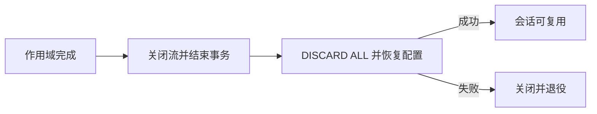

# type-orm-pgsql

PostgreSQL 驱动复用 type-orm 的 Connection、事务和作用域池，独立依赖 pdo_pgsql，不要求 MySQL 驱动或 HTTP 核心。

已在 Linux ARM64、macOS ARM64、Windows x64 完成 PostgreSQL 独立消费者的 PHP、AOT 和无源码运行，属于同提交三库 ORM 矩阵，包含物理连接复用与会话隔离。完整应用及生产高可用按各自场景另行验收，环境与证据见[平台与验收](https://iots.top/#/guide/platforms)。

## 安装与版本

本组件通过 Packagist 提供 Composer 安装，源码在对应 GitHub 子仓维护。Composer 自动解析传递依赖，消费应用无需逐一登记 VCS 仓库。

```sh
composer config minimum-stability dev
composer config prefer-stable true
composer require zoujingli/type-orm-pgsql:dev-main
```

`dev-main` 的分支别名为 `1.0.x-dev`；本仓组件间使用 `~1.0.0@dev` 约束。开发分支不等于已发布稳定 1.0 版本。提交应用的 `composer.lock` 固定实际分发提交；构建工具只放 `require-dev`。详细依赖与公开分发规则见[组件组织与安装](https://github.com/zoujingli/typeapp/blob/main/docs/development/component-structure.md)。

连接采用原生预处理、异常模式及明确的连接超时。主键通过 PostgreSQL 的 RETURNING 语义取得，不假设 MySQL 的自增或 DDL 行为。原生执行仍保留参数绑定、错误信息边界和失效租约检查。

当前验证基线为 PostgreSQL 17，包括真实读写、回滚、提交、SQL 错误和独立消费编译。查询方言、schema、迁移与完整模型业务的准确通过范围见本页链接的三库消费和迁移证据。

## 声明式使用示例

以下声明式入口通过当前作用域借用连接并执行参数绑定查询。只读测试仍需要有效运行配置与原生扩展，示例不会创建服务器数据库或账号。

```php
<?php

declare(strict_types=1);

use Type\Orm\Database;
use Type\Orm\Pgsql\PgsqlDriver;
use Type\Runtime\ExecutionScope;

/** 只在环境键不存在时采用默认值，保留合法的空字符串。 */
function databaseSetting(string $key, string $default): string
{
    $value = getenv($key);

    return $value === false ? $default : $value;
}

/**
 * 借用一个 PostgreSQL 会话执行参数绑定查询，凭据仅在运行时读取。
 */
function main(): void
{
    $port = filter_var(databaseSetting('DB_PORT', '5432'), FILTER_VALIDATE_INT,
        ['options' => ['min_range' => 1, 'max_range' => 65535]]);
    if (!is_int($port)) {
        throw new InvalidArgumentException('DB_PORT 必须为有效整数端口');
    }
    $driver = new PgsqlDriver(databaseSetting('DB_HOST', '127.0.0.1'), $port,
        databaseSetting('DB_DATABASE', 'type_example'), databaseSetting('DB_USERNAME', 'type_example'),
        databaseSetting('DB_PASSWORD', ''));
    $database = new Database($driver, 1, 0);
    $scope = new ExecutionScope();
    try {
        $connection = $database->connect($scope);
        echo json_encode($connection->query('SELECT ? AS value', [7]), JSON_THROW_ON_ERROR) . "\n";
    } finally {
        try {
            $scope->close();
        } finally {
            $database->close();
        }
    }
}
```

## 检查会话并接入模型

参数查询应输出含 `value=7` 的 JSON；该预处理表达式的 PDO 返回值可以是字符串 `"7"`。在示例取得 `$connection` 后，继续检查实际 schema、身份及时区：

```php
$baseline = $connection->query("SELECT current_schema() AS schema, current_user AS role, current_setting('TimeZone') AS timezone");
echo json_encode($baseline, JSON_THROW_ON_ERROR) . "\n";
```

默认时区为 UTC，schema 和角色应对应配置及实际授权；不要把 `public` 当作所有部署的必然结果。随后运行当前 schema 的迁移，再接入模型和事务。一般业务 `Db::transaction()` 接收零参数闭包；底层 `Connection::transaction()` 则向闭包传入同一连接。



超时、schema、TLS、会话重置与错误排查见[PostgreSQL 教程](https://iots.top/#/guide/plugins/type-orm-pgsql)。重置失败不会将污染会话交给下一个请求。

## 接口与源码组织

`src/PgsqlDriver.php` 独立承担 PostgreSQL 配置、DSN、连接身份与基线初始化；查询方言、模型、schema 迁移和事务协议复用 `type-orm`，不建立重复的 PostgreSQL 业务 API。

示例在已有数据库和账号上执行真实参数绑定，不在构造时创建账号或开网络连接。驱动设置 UTC 与 ISO/YMD 日期格式，可显式给出 `schema`、`databaseRole` 和 `caFile`；标识符会校验。CA 启用 `sslmode=verify-full`，证书或主机名不匹配拒绝连接。迁移可利用普通事务 DDL，但某些 PostgreSQL 操作的特殊限制仍需对应场景验证；主键优先复用方言的 RETURNING。

## AOT 与运行要求

Composer 声明 `ext-pdo_pgsql`，不要求 MySQL、SQLite 或 core。AOT 携带匹配的 PDO PostgreSQL 模块、实际 `libpq` 及传递依赖和 PHPX/libphp；TLS 使用受信任的外部 CA。服务器基线不意味着所有 PostgreSQL 兼容产品已验收。

语言与整体编译约定见[TypePHP 0.9 基线](https://github.com/zoujingli/typeapp/blob/main/docs/standards/typephp.md)。文中的声明式示例不使用省略实参的回调兼容层；带上下文的闭包必须完整声明参数。

## 主仓验证入口

以下命令在安装完整开发依赖的 [TypeApp 开发主仓](https://github.com/zoujingli/typeapp/blob/main/composer.json)根执行，不是分发子仓默认自带的脚本。需要真实数据库、Redis、Linux SDK 或容器的用例应按其文档准备专属测试环境；先构建相应产物，再运行 native 验收。

```sh
composer build:pgsql
composer test:pgsql
composer test:pgsql-consumer
php tests/orm-suite-consumer.php pgsql
php tests/orm-suite-consumer.php pgsql --native
```

Linux/macOS 原生服务器验收可用 `php tests/native-database-consumer.php pgsql "$TYPE_PGSQL_TOOLS"`，工具根由调用环境明确提供。入口只启动本轮专用回环实例，比较独立安装消费者的 PHP/AOT 参数绑定、RETURNING、事务、会话基线、schema/角色读写与完整迁移恢复，结束后停止实例。直接运行独立数据 fixture 时，专用测试账号须能创建和清理测试角色/schema；普通业务连接不需要这些测试权限。设置 `TYPE_EXPECT_SELECTED_DRIVER_ONLY=1` 还会断言控制端和原生产物实际只加载 `pdo_pgsql`，需事先选择对应的单驱动 SDK。

`php tests/native-database-tls.php pgsql "$TYPE_PGSQL_TOOLS" build/tls/type-app` 复用已构建 TLS 产物，生成临时证书并验证正确 CA、错误 CA、可达但证书不匹配的主机名和 CA 内容变化；结束后回收实例及测试私钥。

- [三库独立消费矩阵](https://github.com/zoujingli/typeapp/blob/main/docs/development/orm-consumer-matrix.md)
- [TLS 证书与主机名验证](https://github.com/zoujingli/typeapp/blob/main/docs/development/tls-verification.md)
- [三库迁移](https://github.com/zoujingli/typeapp/blob/main/docs/development/native-migrations.md)
