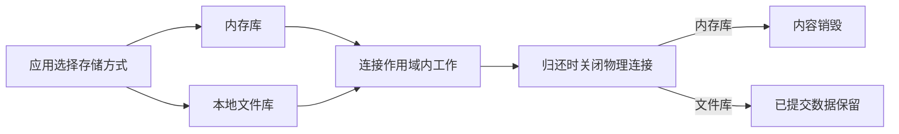

# type-orm-sqlite

SQLite 驱动支持本地文件和普通 `:memory:`，每连接显式设置外键、busy 等待上限；文件库默认验证 WAL 并采用 FULL 同步。

已在 Linux ARM64、macOS ARM64、Windows x64 完成 SQLite 独立消费者的 PHP、AOT 和无源码运行，属于同提交三库 ORM 矩阵。Windows 文件库支持盘符绝对路径；当前归还时关闭物理连接，物理复用及完整应用不计为完成，环境与证据见[平台与验收](https://iots.top/#/guide/platforms)。

## 安装与版本

本组件通过 Packagist 提供 Composer 安装，源码在对应 GitHub 子仓维护。Composer 自动解析传递依赖，消费应用无需逐一登记 VCS 仓库。

```sh
composer config minimum-stability dev
composer config prefer-stable true
composer require zoujingli/type-orm-sqlite:dev-main
```

`dev-main` 的分支别名为 `1.0.x-dev`；本仓组件间使用 `~1.0.0@dev` 约束。开发分支不等于已发布稳定 1.0 版本。提交应用的 `composer.lock` 固定实际分发提交；构建工具只放 `require-dev`。详细依赖与公开分发规则见[组件组织与安装](https://github.com/zoujingli/typeapp/blob/main/docs/development/component-structure.md)。

普通内存库每条连接独立，不能把多连接池当作共享内存数据库；需要持续使用同一内存库时应选择单连接，并理解归还后销毁连接会同时销毁库。文件库使用绝对路径及已存在的本地目录，不承诺在共享网络文件系统上运行 WAL。

WAL 允许读者与写者并行，但仍只有一个写者；长读事务会阻止检查点完成，不能无限持有。当前测试覆盖写竞争、busy 上限、外键、事务、检查点、重新打开文件及 SIGKILL 后恢复已提交数据。

该驱动独立依赖 PDO SQLite 和 type-orm，不要求 MySQL、PostgreSQL 或 HTTP 核心。高级 SQL 能力按数据库实际语义处理，不提供伪装成行锁的兼容操作。

## 声明式使用示例

以下声明式入口通过当前作用域借用连接并执行参数绑定查询。只读测试仍需要有效运行配置与原生扩展，示例不会创建服务器数据库或账号。

```php
<?php

declare(strict_types=1);

use Type\Orm\Database;
use Type\Orm\Sqlite\SqliteDriver;
use Type\Runtime\ExecutionScope;

/**
 * 在单一连接内执行查询，内存库会随连接关闭销毁。
 *
 * @param list<string> $argv 可选第二项为已准备目录中的 SQLite 绝对路径。
 */
function main(int $argc, array $argv): void
{
    $filename = $argv[1] ?? ':memory:';
    $database = new Database(new SqliteDriver($filename), 1, 0);
    $scope = new ExecutionScope();
    try {
        $connection = $database->connect($scope);
        echo json_encode($connection->query('SELECT ? AS value', [7]), JSON_THROW_ON_ERROR) . "\n";
    } finally {
        try {
            $scope->close();
        } finally {
            $database->close();
        }
    }
}
```

## 从内存练习到持久存储

默认示例输出 `[{"value":7}]`，只在当前连接内练习。要保存跨请求数据，先为应用创建可写的本地数据目录，再传入数据库文件的绝对路径。文件数据库通过版本化迁移建表，不能在每次请求中重新执行示例 DDL。



[SQLite 教程](https://iots.top/#/guide/plugins/type-orm-sqlite)提供建表、参数写入、回滚验证和文件清理步骤。重点观察失败事务后的原值、文件重新打开后的已提交值；SQLite 只有一个写者，增加连接数量不会增加并行写入能力。

## 接口与源码组织

`src/SqliteDriver.php` 持有文件/内存路径、busy 超时、外键、WAL/FULL 与只读角色基线。连接租约、事务、模型与迁移继续复用 `type-orm`；不把 SQLite 限制包装成不存在的网络数据库能力。

上例默认内存库，只在当前连接存活期间有意义；传入文件路径时要求绝对路径和已存在目录，驱动不会代应用创建目录。`busyMilliseconds` 允许 0–60000，`wal` 在内存库上自动不启用；文件 WAL 必须由实际 PRAGMA 返回确认。reader 角色启用 query_only，不把它当作独立文件权限沙箱。SQLite 不支持的行锁、并行写者或高级 SQL 应明确拒绝，不能模拟成功。

## AOT 与运行要求

Composer 声明 `ext-pdo_sqlite`，无 HTTP 或服务器型数据库依赖。AOT 需要实际嵌入/共享 PDO SQLite 及 SQLite 库、匹配 PHPX/libphp；不能假设静态内置的 SQLite 可通过删除 ini 卸载。文件数据库放独立可写本地数据卷，代码镜像只读不代表数据库不需要持久化。

语言与整体编译约定见[TypePHP 0.9 基线](https://github.com/zoujingli/typeapp/blob/main/docs/standards/typephp.md)。文中的声明式示例不使用省略实参的回调兼容层；带上下文的闭包必须完整声明参数。

## 主仓验证入口

以下命令在安装完整开发依赖的 [TypeApp 开发主仓](https://github.com/zoujingli/typeapp/blob/main/composer.json)根执行，不是分发子仓默认自带的脚本。需要真实数据库、Redis、Linux SDK 或容器的用例应按其文档准备专属测试环境；先构建相应产物，再运行 native 验收。

```sh
composer build:sqlite
composer test:sqlite
composer test:sqlite-consumer
php tests/orm-suite-consumer.php sqlite
php tests/orm-suite-consumer.php sqlite --native
```
