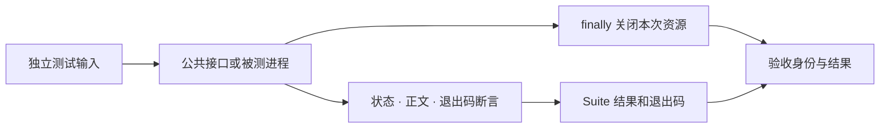

# type-testing

供应用开发期使用的集成测试工具，通过 Composer 的 require-dev 安装。断言作用于插件公共接口、命令输出和真实 HTTP，既可以驱动 PHP 开发入口，也可以驱动已编译二进制；生产应用不会因此加载测试框架或回退解释源码。

## 阅读与操作路径

先用下方例子验证一个不依赖数据库的帮助命令，再按[测试教程](https://iots.top/#/guide/plugins/type-testing)对核心教程的 `/status` 和 `/missing` 发起真实请求。期望分别为成功 JSON 与 404，任何连接、协议或断言失败都应保留真实失败类别。



测试工具只清理自己创建的资源，不接管用户已有服务。进程例子必须保留 `finally stop()`；HTTP 客户端在每次请求结束或异常后关闭自己的连接。PHP 对照与原生产物使用相同断言时，仍分别记录实际执行结果。

## 安装与版本

本组件通过 Packagist 提供 Composer 安装，源码在对应 GitHub 子仓维护。Composer 自动解析传递依赖，消费应用无需逐一登记 VCS 仓库。

```sh
composer config minimum-stability dev
composer config prefer-stable true
composer require --dev zoujingli/type-testing:dev-main
```

`dev-main` 的分支别名为 `1.0.x-dev`；本仓组件间使用 `~1.0.0@dev` 约束。开发分支不等于已发布稳定 1.0 版本。提交应用的 `composer.lock` 固定实际分发提交；构建工具只放 `require-dev`。详细依赖与公开分发规则见[组件组织与安装](https://github.com/zoujingli/typeapp/blob/main/docs/development/component-structure.md)。

```php
<?php

declare(strict_types=1);

use Type\Testing\Assert;
use Type\Testing\Process;
use Type\Testing\Suite;

/**
 * 验收调用方明确传入的应用二进制，不扫描进程或寻找系统中的服务。
 *
 * @param list<string> $argv 第二项为待验收二进制路径。
 */
function main(int $argc, array $argv): void
{
    $binary = $argv[1] ?? '';
    if ($binary === '') {
        throw new InvalidArgumentException('请传入待验收的原生应用绝对路径');
    }
    $suite = new Suite();
    $suite->test('帮助命令无需数据库', static function () use ($binary): void {
        $process = new Process([$binary, 'help']);
        try {
            $result = $process->wait(3.0);
            Assert::true($result->successful());
        } finally {
            $process->stop();
        }
    });
    $exit = $suite->run();
    echo json_encode($suite->results(), JSON_THROW_ON_ERROR | JSON_UNESCAPED_UNICODE) . "\n";
    exit($exit);
}
```

`Assert::same` 使用严格类型比较，`true` 验证条件，`throws` 返回指定类型的真实异常。Suite 的名称必须唯一，失败继续收集，退出码为 0 或 1；默认不自动打印任意业务值、异常堆栈或测试秘密。

`Suite::test()` 和 `Assert::throws()` 都接收零参数 `Closure(): mixed`，返回值忽略。需要调用带上下文的业务回调时，在测试体内按该业务接口的完整签名登记，不依赖 PHP 忽略多余实参。

Process 使用数组命令直接启动，不经 shell 插值。stdout/stderr 同时排空，默认总输出上限 2 MiB；等待使用单调总截止。超时或输出超限先请求平台停止，宽限后强制终止，只有确认退出才返回 ProcessResult。结果保留退出码、信号、stdout/stderr 和失败原因，重复 wait/stop 返回同一终态。调用者必须在 finally 中 stop，不能依赖 PHP 进程资源析构去等待未知时长。

第五个可选参数`stdinFile`把可读普通文件以只读二进制方式直接连接到子进程标准输入，例如为数据库客户端提供备份文件；默认仍为空输入。不拼接shell重定向，不在父进程中缓存文件内容。相对路径按调用方工作目录解析，不随子进程工作目录改变；目录、设备、缺失及NUL路径在启动前拒绝。调用者负责保持输入内容稳定直至进程结束，此接口不提供文件锁或可信备份校验。

Unix 使用非阻塞管道与 SIGTERM／SIGKILL。Windows 使用 NUL、临时输出文件的独立读句柄与进程组；可用时发送 CTRL_BREAK，无法使用控制事件时终止进程且保留实际非零状态，不声称正常排空。公开跨平台测试为 `tests/testing-portable.php`；[历史 Windows 运行](https://github.com/zoujingli/typeapp/actions/runs/35567372098)已通过进程与平台行为步骤，结果归属其固定提交，不替代新版 HTTP 控制事件排空或完整应用验收。临时输出文件只用于测试，避免写入生产密钥。

进程工具处理自己启动的直接子进程，不是操作系统沙箱；Windows 控制事件会发送到本次创建的进程组，强制终止仅针对直接子进程。涉及子孙进程或不合作内核 I/O 时，使用对应平台的作业对象／服务监督器限制进程树，不将其他用户进程加入清理范围。

`HttpClient('http://127.0.0.1:端口')` 提供 `request(method, target, headers, body)`，返回 HttpResponse 的 status、headers、body、json()。每次新连接、不跟随重定向，固定 Host/Connection/Content-Length，拒绝头注入。总时间和响应大小有上限，验证 Content-Length 或完整 chunked 结束，不把截断响应当成功；保留重复响应头。HTTPS 使用系统信任和主机校验；不提供跳过证书校验选项。客户端面向 HTTP/1.x 测试，不承诺 HTTP/2、trailer 或任意传输编码支持。

真实行为检查位于主仓 `tests/testing.php`：双管道大输出、退出码、字面参数、输出写满、无视 SIGTERM 的子进程、严格断言及真实 TCP 响应截断。独立消费者只需安装 runtime 与 testing；不隐式要求 core、数据库或 Redis 扩展。

## 接口与源码组织

`Suite/Assert/AssertionFailed` 负责测试登记、严格断言与结果；`Process/ProcessResult` 负责有界子进程控制；`HttpClient/HttpResponse` 负责真实 HTTP 交互及完整性检查。它们是三个清晰入口，当前不需要每个类单独建目录或引入新的测试 DSL。

上例是声明式验收程序；若作为普通 PHP 开发测试运行，可由专用开发启动器加载 Composer 后显式调用 `main()`。不要把测试工具写进生产 `require` 来驱动业务。测试名与断言信息应说明行为，不打印秘密；超时/输出超限仍须检查终态。HTTP 客户端不替代浏览器或生产重试客户端，进程接口不是安全沙箱。

## AOT 与运行要求

通常作为 PHP 开发工具执行，仅需其 Composer 声明的 runtime 与 JSON 能力。确需编译独立验收程序时，本包有 `extra.type.sources` 可纳入整体 AOT，运行同样需要 PHPX/libphp；这不要求被测生产应用携带 PHP 测试源码或测试框架。

语言与整体编译约定见[TypePHP 0.9 基线](https://github.com/zoujingli/typeapp/blob/main/docs/standards/typephp.md)。文中的声明式示例不使用省略实参的回调兼容层；带上下文的闭包必须完整声明参数。

## 主仓验证入口

以下命令在安装完整开发依赖的 [TypeApp 开发主仓](https://github.com/zoujingli/typeapp/blob/main/composer.json)根执行，不是分发子仓默认自带的脚本。需要真实数据库、Redis、Linux SDK 或容器的用例应按其文档准备专属测试环境；先构建相应产物，再运行 native 验收。

```sh
composer test:testing
composer test:testing-portable
composer test:testing-consumer
```

- [独立应用模板验收](https://github.com/zoujingli/typeapp/blob/main/docs/development/application-template.md)
- [真实集成验收](https://github.com/zoujingli/typeapp/blob/main/docs/development/integration.md)
